# Azure Certification Roadmap

> Basics to Associate to Expert and Specialty certification paths.

```mermaid
flowchart LR
    subgraph be [Basic Exams]
        direction TB
        az900["`
        **Exam AZ-900**
        _Azure Fundamentals_
        `"]
        click az900 href "https://learn.microsoft.com/en-us/certifications/exams/az-900/" "az-900"
        dp900["`
            Exam **DP-900**
            _Data Fundamentals_
        `"]
    end
    subgraph fc ["`_FUNDAMENTALS_ CERTIFICATION`"]
        direction TB
        azFund("`
            Azure Fundamentals
        `")
        click azFund href "https://learn.microsoft.com/en-us/certifications/azure-fundamentals/" "az-900"
        az900-->azFund
        dataFund("`
            Microsoft Certified
            _Azure Data Fundamentals_
        `")
        dp900-->dataFund
        click dp900 href "https://learn.microsoft.com/en-us/certifications/exams/dp-900/" "dp-900"
        click dataFund href "https://learn.microsoft.com/en-us/certifications/azure-fundamentals/" "az-900"
    end
    subgraph ae ["Associate Exams"]
        direction TB
        az204["`
            **Exam AZ-204**
            Developing
            Solutions
        `"]
        click az204 href "https://learn.microsoft.com/en-us/certifications/exams/az-204/" "az-204"
        az104["`
            **AZ-104**
            Implement, manage, monitor
            cloud solutions
        `"]
        click az104 href "https://learn.microsoft.com/en-us/certifications/exams/az-104" "Exam AZ-104: Microsoft Azure Administrator"
        dp420["`
            Exam **DP-420**
            Designing and Implementing
            Cloud-Native Applications
            Using Microsoft Azure Cosmos DB
        `"]
        click dp420 href "https://learn.microsoft.com/en-us/certifications/exams/dp-420/" "dp-420"
        az500["`
            **AZ-500**
            Security
            Technologies
        `"]
        click az500 href "https://learn.microsoft.com/en-us/certifications/exams/az-500/" "Exam AZ-500: Microsoft Azure Security Technologies"
        sc300["`
            **SC-300**
            _Identity_ & _Access_
            Administrator
        `"]
        click sc300 href "https://learn.microsoft.com/en-us/certifications/exams/sc-300/" "Exam SC-300: Microsoft Identity and Access Administrator"
    end
    fc-. X .-> ae
    subgraph ac [ASSOCIATE CERTIFICATION]
        direction TB
        azDevAssoc["`
            Azure
            **Developer**
            Associate
        `"]
        click azDevAssoc "https://learn.microsoft.com/en-us/certifications/azure-developer" "azure-developer"
        az204-->azDevAssoc
        azAdminAssoc("`
            Azure
            **Administrator**
            Associate
        `")
        click azAdminAssoc href "https://learn.microsoft.com/en-us/certifications/azure-administrator/" "Microsoft Certified: Azure Administrator Associate"
        az104-->azAdminAssoc
        cosmosSpec("`
            Cosmos DB
            Developer
            **Specialty**
        `")
        click cosmosSpec href "https://learn.microsoft.com/en-us/certifications/azure-cosmos-db-developer-specialty/" "cosmos-db-developer-specialty"
        dp420-->cosmosSpec
        azSecEng("`
            Security
            Engineer
            Associate
        `")
        click azSecEng href "https://learn.microsoft.com/en-us/certifications/azure-security-engineer/" "Microsoft Certified: Azure Security Engineer Associate"
        az500-->azSecEng
        iaAdmin("`
        Identity & Access
        Administrator
        Associate
        `")
        click iaAdmin href "https://learn.microsoft.com/en-us/certifications/identity-and-access-administrator/" "Microsoft Certified: Identity and Access Administrator Associate"
        sc300-->iaAdmin
    end
    subgraph ee [expert exams]
        direction TB
        az305["`
            **AZ-305**
            Design
            Infrastructure
        `"]
        click az305 href "https://learn.microsoft.com/en-us/certifications/exams/az-305" "Design and implement end-to-end cloud solutions"
        azAdminAssoc-->az305;
        az400["`
            **AZ-400**
            Design & Implement
            DevOps Solutions
        `"]
        click az400 href "https://learn.microsoft.com/en-us/certifications/exams/az-400/" "Exam AZ-400: Designing and Implementing Microsoft DevOps Solutions"
        azDevAssoc-->az400
        azAdminAssoc-->az400
        sc100["`
            **SC-100**
            Cybersecurity
            Architect
        `"]
        click sc100 href "https://learn.microsoft.com/en-us/certifications/exams/sc-100/" "Exam SC-100: Microsoft Cybersecurity Architect"
        azSecEng-->sc100
        iaAdmin-->sc100
    end
    ac-..-ee
    subgraph ec [EXPERT CERTIFICATION]
        direction TB
        azSolArch("`
            _Azure Solutions_
            **Architect**
            Expert
        `")
        click azSolArch "https://learn.microsoft.com/en-us/certifications/azure-solutions-architect" "azure-solutions-architect"
        az305-->azSolArch
        devOpsExpert["`
            _DevOps_
            Engineer
            Expert
        `"]
        click devOpsExpert href "https://learn.microsoft.com/en-us/certifications/devops-engineer/" "Microsoft Certified: DevOps Engineer Expert"
        az400--->devOpsExpert
        csecArch("`
            Cybersecurity
            Architect
            Expert
        `")
        click csecArch href "https://learn.microsoft.com/en-us/certifications/cybersecurity-architect-expert/" "Microsoft Certified: Cybersecurity Architect Expert"
        sc100-->csecArch
    end
```

## Exam Prep Resources

- itexams.com
- mindhub
- whizlabs
- certbolt

[<](./index.md) | [<<](/index.md)
