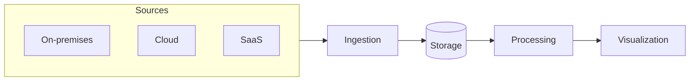
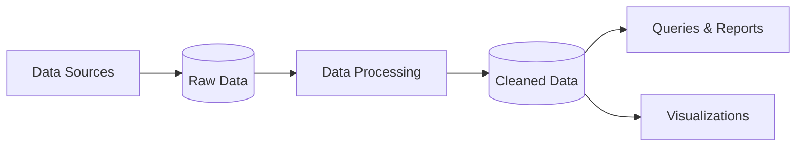
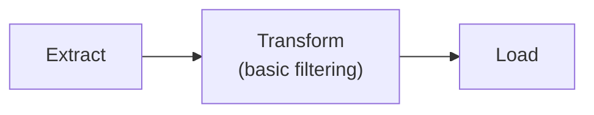
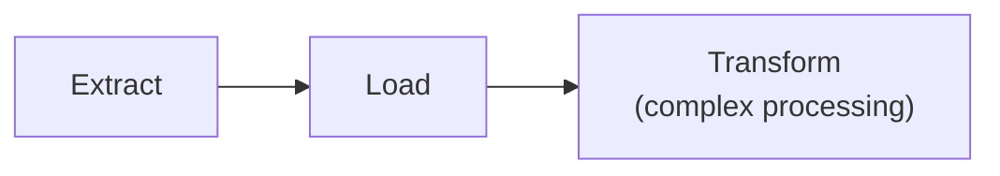
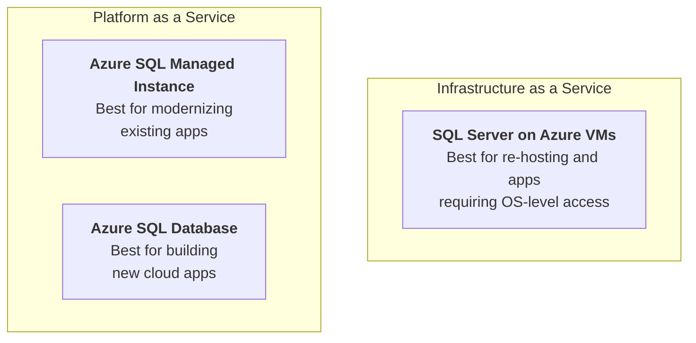
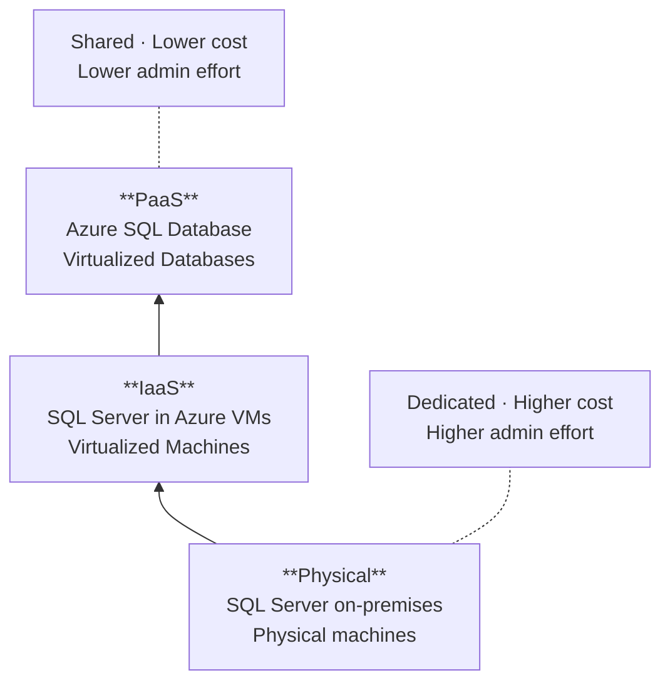
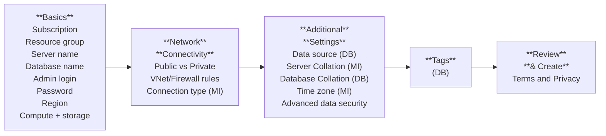
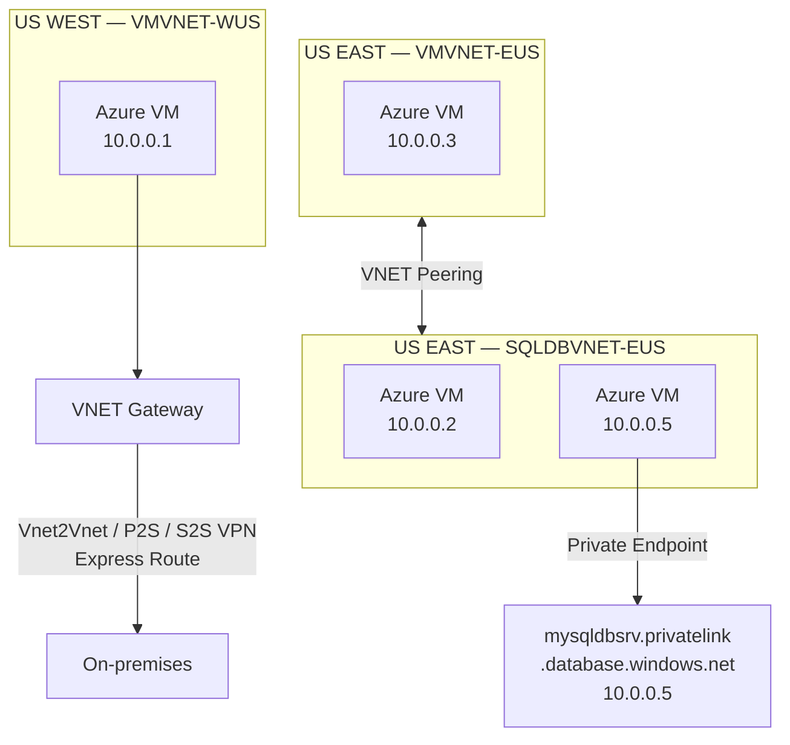

# DP-900 Azure Data Fundamentals

> Course notes from the Microsoft DP-900 exam preparation covering core data concepts, relational and non-relational data on Azure.

## Course Agenda

Module | Topic
---|---
1 | Explore core data concepts
2 | Explore relational data in Azure
3 | Explore non-relational data in Azure
4 | Explore data analytics in Azure

### MOC Learning Paths

- Explore core data concepts [1]
- Explore relational data in Azure [2]
- Explore non-relational data in Azure [3]

## Core Data Concepts

### Analytical Data Processing



**OLAP** systems are optimized for read-heavy analytical workloads. Data flows from operational sources through ingestion into a centralized store, gets processed, and is surfaced through visualization tools.

### NoSQL Database Types

Type | Description | Example
---|---|---
**Key-value** | Data stored as key-value pairs | `Azure Table Storage`, Redis
**Document** | Data stored as JSON-like documents | `Azure Cosmos DB`, MongoDB
**Column family** | Data organized into rows and column families | Apache Cassandra, HBase
**Graph** | Data stored as nodes and edges representing relationships | `Azure Cosmos DB` (Gremlin API), Neo4j

### Data Ingestion Pipeline



### Data Processing Services

Service | Purpose
---|---
`Azure Functions` | Event-driven serverless compute for lightweight processing
`Azure Cognitive Services` | AI-powered data enrichment (vision, language, speech)
`Azure Databricks` | Apache Spark-based analytics for large-scale data processing

### ETL and ELT Patterns

**ETL** (Extract, Transform, Load) — data is transformed before loading into the destination:



**ELT** (Extract, Load, Transform) — data is loaded first, then transformed in the destination system:



ELT is preferred when the destination has sufficient compute power for transformations (e.g., data warehouses, `Azure Synapse Analytics`).

## Azure SQL Data Services

### Service Overview



### IaaS vs PaaS Deployment Model



### SQL Server on Azure Virtual Machines

Aspect | Details
---|---
**Customer challenge** | Migrate to cloud fast while maintaining OS control and complete SQL Server functionality
**Solution** | Combined performance, security, and analytics backed by the flexibility and hybrid connectivity of Azure
**Key features** | Full SQL Server and OS access; expansive SQL and OS versions; Windows, Linux, Containers; file stream, DTC, Simple Recovery; `SSAS`, `SSRS`, `SSIS`
**Azure differentiators** | Extended Security Updates for SQL Server 2008/R2; automated backups; Point in Time Restore with `Azure Backup`; accelerated storage with Azure Blob Caching; 435% overall return on Azure IaaS investment over five years

### SQL Server VM Deployment Choices

Category | Options
---|---
**Deployment** | Marketplace pre-installed on Windows or Linux; install your own; Lift and Shift with `Azure Migrate` (Azure Site Recovery)
**Resource Provider** | Unlock licensing and edition flexibility; automated backups and security updates; manage VMs through Azure SQL in portal
**Sizes and Storage** | Memory or Storage optimized sizes; Tempdb on local SSD; data log on `Premium Storage Managed Disks`; ultra disks for extremely low latency; Azure Blob Read Caching for data disks
**Networking and Security** | Virtual Networks to integrate with on-premises; Advanced Data Security services (Preview)
**HADR** | Azure VM built-in HA; Azure Storage built-in DR; Failover Cluster Instance with `Azure Premium File Share`; Always On Availability Groups with Cloud Witness; Hybrid Availability Group secondary replicas; HADR on RedHat Linux with Pacemaker and fencing; `Azure Backup` and automated backups to `Azure Blob Storage`; File-Snapshot Backups

### Azure SQL Database

Aspect | Details
---|---
**Customer challenge** | Build modern, multi-tenanted apps with highest uptime and predictable performance
**Solution** | Highly scalable cloud database service with built-in HA and machine learning
**Key features** | Single database or elastic pool; Hyperscale storage (100TB+); serverless compute; fully managed service; Private Link support; high availability with AZ isolation
**Azure differentiators** | Industry highest availability SLA of 99.995%; business continuity SLA with 5-second RPO and 30-second RTO; price-performance leader costing up to 86% less than AWS RDS (GigaOm)

### Azure SQL Managed Instance

Aspect | Details
---|---
**Customer challenge** | Migrate to cloud, remove management overhead, but need instance-scoped features (Service Broker, SQL Server Agent, CLR)
**Solution** | Combines leading security features with SQL Server compatibility and business model designed for on-premises
**Key features** | Single instance or instance pool; SQL Server surface area (vast majority); native virtual network support; fully managed service; on-premises identities with Azure AD and AD Connect
**Azure differentiators** | Near zero downtime migration using log shipping; fully managed business continuity with failover groups; projected ROI of 212% over three years; the best of SQL Server with benefits of a managed service

### Managed Instance vs SQL Database

Feature | Azure SQL Managed Instance | Azure SQL Database
---|---|---
**Single instance** | SQL Server surface area (vast majority); native VNet support; fully managed | Single database; Hyperscale storage (up to 100TB); serverless compute; fully managed
**Instance pool** | Pre-provision compute resources for migration; enables cost-efficient migration; ability to host smaller instances (2 VCore); currently in public preview | Elastic pool; resource sharing between multiple databases; simplified performance management; fully managed

### Benefits of Azure Database for MySQL, PostgreSQL, MariaDB

- **Fully managed community database** — take advantage of a fully managed service while still using familiar tools and languages
- **Built-in high availability** for lowest TCO — data is always available without additional costs
- **Intelligent performance and scale** — built-in intelligence and up to 16TB storage and 20K IOPs
- **Industry-leading security and compliance** — enhanced security with Advanced Threat Protection
- **Integration with the Azure ecosystem** — build apps faster with Azure services and safeguard innovation with Azure IP Advantage

### Azure Database for PostgreSQL

- **Fully managed and secure** — supports a large variety of Postgres versions with best-in industry indemnification coverage
- **Intelligent performance optimization** — improve performance and reduce cost with customized recommendations
- **Flexible and open** — leverage Microsoft's contributions to the Postgres community and use favorite extensions
- **High performance scale-out with Hyperscale** — break free from single-node limits and scale out across hundreds of nodes

Deployment options: **Single Server** and **Hyperscale** (Citus).

### Configure Relational Data Services



### Connectivity and Firewalls

```
                         WEST US
                    ┌──────────────────────┐
mysqldbsrv.         │  ┌────┐  ┌────┐     │    ┌───────────┐
database.            │  │ GW │  │ GW │─────┼───>│  SQL DBs  │
windows.net          │  └────┘  └────┘     │    └───────────┘
                    │  23.99.34.75         │
                    │                      │
  ┌─────┐  proxy   │  ┌────┐              │
  │ SQL │──────────>│  │ GW │              │    ┌───────────┐
  └─────┘           │  ├────┤              │───>│  SQL DBs  │
     │              │  │ GW │              │    └───────────┘
     └─(1) redirect │  ├────┤              │
         find-db    │  │ GW │  ┌────┐      │
                    │  └────┘  │ GW │      │
                    │  104.42.238.205      │    ┌───────────┐
                    └──────────────────────┘───>│  SQL DBs  │
                                                └───────────┘
westus1-a.control.database.windows.net
104.42.238.205, port 1433
```

Connections route through a **gateway cluster** using the **proxy** connection policy. The gateway redirects the client to the database node hosting the data (redirect-find-db).

### Authentication and Access Control

**Mixed Mode** authentication is enforced. SQL Auth for deployment uses the **server admin** principal:

- **Server admin** — server-level principal for logical server (DB) and member of sysadmin server role (MI)

**Azure AD Authentication** options:

Service | Supported Identity Types
---|---
**Azure SQL Managed Instance** | Azure AD Server Admin; SQL or Azure AD Logins; Database Users; SQL Server Contained Database supported
**Azure SQL Database** | Azure AD Server Admin; SQL logins; loginmanager and dbmanager roles for limited server admins; Database Users; Contained Database Users including Azure AD (recommended)

### Network Security



Network security layers for Azure SQL Database:

- **Allow access to Azure services** — permit connections from other Azure resources
- **Firewall Rules** — IP-based access control
- **Virtual Network Rules** — restrict access to specific VNet subnets
- **Private Link** — access via private endpoint within VNet; public endpoint blocked (`mysqldbsrv.database.windows.net` has no internet access)

### Azure Role Based Access Control (RBAC)

- All Azure operations for Azure SQL are controlled through **RBAC**
- Security principal and role-based system
- Scope includes subscription, resource group, and resource
- Decoupled from SQL Security (today)
- Applies to operations in Azure portal and CLI
- Allows for _separation of duties_ for deployment, management, and usage
- Azure locks help protect resources from delete or read-only
- Built-in Azure SQL roles reduce need for owner

Built-in role | Scope
---|---
SQL DB Contributor | Database operations
SQL Managed Instance Contributor | Managed Instance operations
SQL Security Manager | Security configuration
SQL Server Contributor | Server-level operations

### Read Replicas

- Read replicas improve performance and scale of **read-intensive workloads** such as BI and analytics
- Consider the read replica feature when delays in syncing data between master and replicas are acceptable
- Create a replica in a different Azure region from the master for a **disaster recovery** plan
- Data storage on replica servers grows automatically without impacting workloads
- Create up to **five replicas** of the master server for Application, BI and Analytics Reporting, and Dashboard workloads

## Non-Relational Data

### Blob Storage Types

Type | Max Size | Use Case | Details
---|---|---|---
**Block blobs** | 4.7 TB | Large, discrete binary objects that change infrequently | Individual blocks up to 100 MB; up to 50,000 blocks per blob
**Page blobs** | 8 TB | Random read/write access | Organized as a collection of fixed-sized 512-byte pages; used for **virtual disk storage** (VMs)
**Append blobs** | 195 GB | Optimized for append operations | Individual blocks up to 4 MB; a block blob variant

### Cosmos DB Use Cases

Scenario | Description
---|---
**Web and retail** | Multi-master replicated model alongside Microsoft's e-commerce; data architecture to support web and mobile with sub-10ms response times; in-game stats, social media integration, and high-score leader boards
**Gaming** | Engineers perform graphical processing on mobile/console clients but rely on the cloud for personalized and customizable content
**IoT** | Hundreds of thousands of devices designed and sold to sense remote data across Internet of Things (IoT) devices; using technologies like Azure IoT Hub, Data Engineers can easily design data solutions that capture real-time data; `Cosmos DB` can accept and store this information very quickly

[1]: https://docs.microsoft.com/en-gb/learn/paths/azure-data-fundamentals-explore-core-data-concepts
[2]: https://docs.microsoft.com/en-gb/learn/paths/azure-data-fundamentals-explore-relational-data/
[3]: https://docs.microsoft.com/en-gb/learn/paths/azure-data-fundamentals-explore-non-relational-data/

[<](./index.md) | [<<](/index.md)
