# Implementing Hybrid Infrastructure

## resources

- [Azure Stack](https://azure.microsoft.com/en-gb/overview/azure-stack/) Build and run hybrid apps across data centres, edge locations, remote offices and the cloud
- [Hybrid Identity](https://docs.microsoft.com/en-gb/azure/architecture/solution-ideas/articles/hybrid-identity)
- [Azure Virtual WAN](https://docs.microsoft.com/en-gb/azure/virtual-wan/virtual-wan-about)
- [Connect](https://docs.microsoft.com/en-gb/azure/architecture/reference-architectures/hybrid-networking/) an on-premises network to Azure
- aure architecture [hybrid](https://docs.microsoft.com/en-gb/azure/architecture/browse/?azure_categories=hybrid)
- [Microsoft Learn for Azure](https://docs.microsoft.com/en-gb/learn/azure/)
- Manage hybrid Azure workloads using Windows [Admin Center](https://docs.microsoft.com/en-gb/azure/architecture/hybrid/hybrid-server-os-mgmt)
- Manage configurations for Azure Arc enabled servers [msdocs](https://docs.microsoft.com/en-gb/azure/architecture/hybrid/azure-arc-hybrid-config)
- Azure Stack HCI solution overview [msdocs](https://docs.microsoft.com/en-gb/azure-stack/hci/overview)
- Hybrid file services / file sync [msdocs](https://docs.microsoft.com/en-gb/azure/architecture/hybrid/hybrid-file-services)
- What is the [Azure Backup service](https://docs.microsoft.com/en-gb/azure/backup/backup-overview) ?
- [About](https://docs.microsoft.com/en-gb/azure/site-recovery/site-recovery-overview) Site Recovery
- [What](https://docs.microsoft.com/en-gb/azure/azure-relay/relay-what-is-it) is `Azure Relay`?
- `Arc`
  - [data services](https://docs.microsoft.com/en-gb/azure/azure-arc/data/overview)
  - Azure Arc [enabled Kubernetes](https://docs.microsoft.com/en-gb/azure/azure-arc/kubernetes/overview)
- Remote access to on-premises applications through [Azure AD Application Proxy](https://docs.microsoft.com/en-gb/azure/active-directory/app-proxy/application-proxy)
- Azure App Service [Hybrid Connections](https://docs.microsoft.com/en-gb/azure/app-service/app-service-hybrid-connections)

## pics

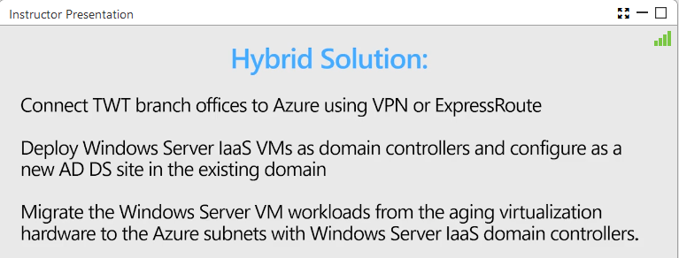
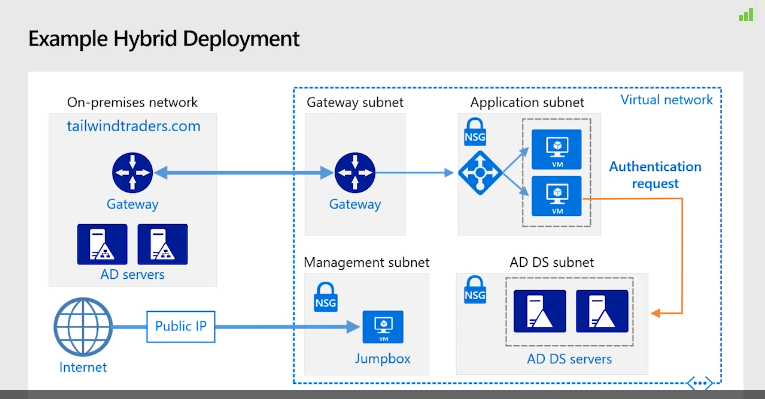
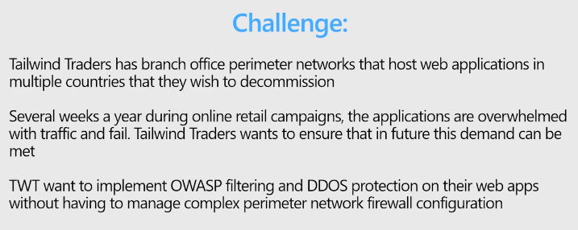
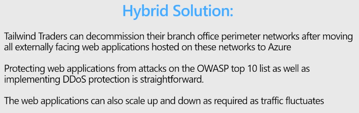
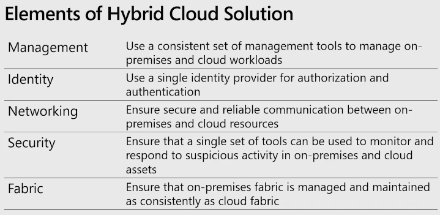
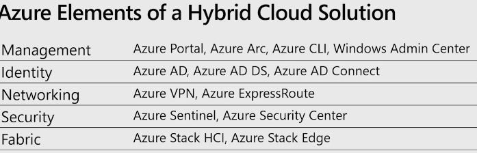
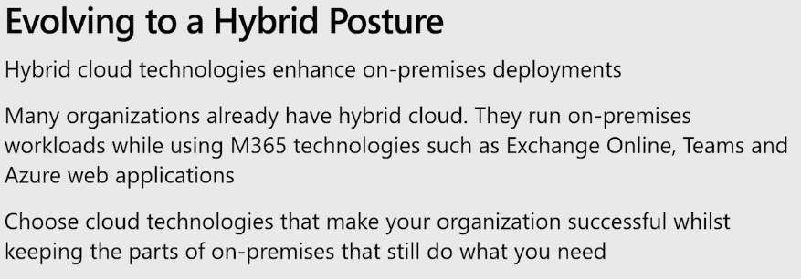
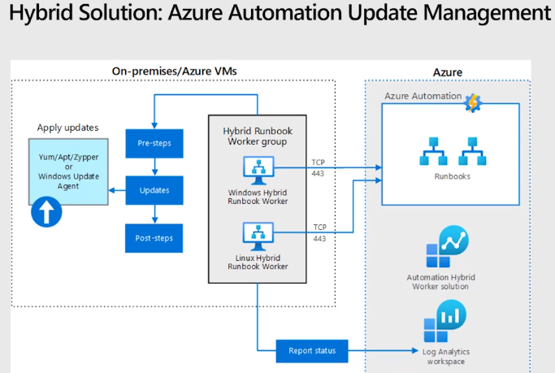
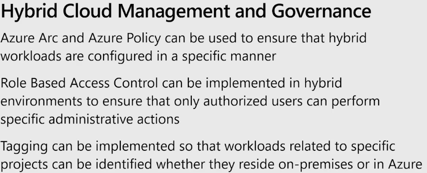
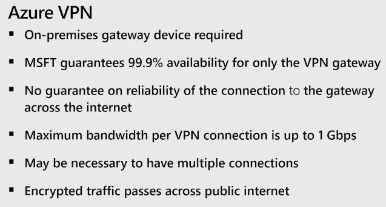
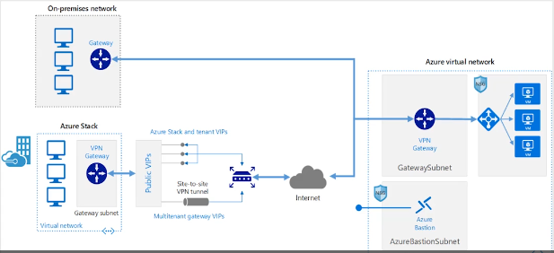
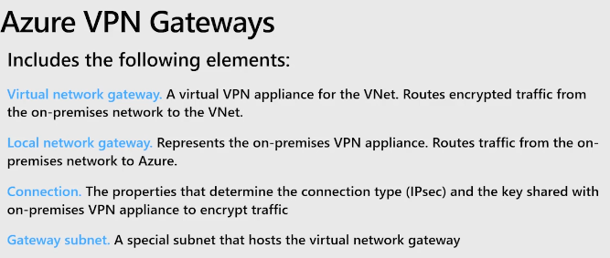
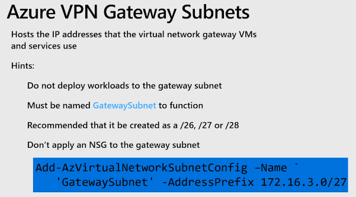
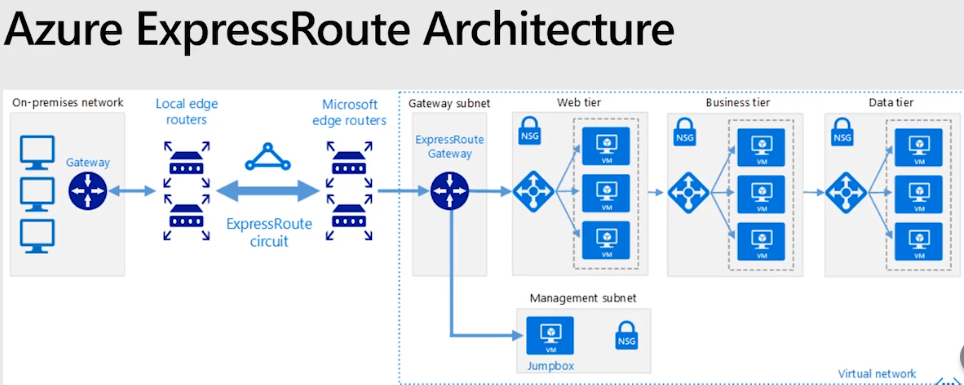

[<< home](../az.md) | [< back](../lectures.md)
