# Implementing Hybrid Infrastructure

## resources

- Azure Stack [1] Build and run hybrid apps across data centres, edge locations, remote offices and the cloud
- Hybrid Identity [2]
- Azure Virtual WAN [3]
- Connect [4] an on-premises network to Azure
- aure architecture hybrid [5]
- Microsoft Learn for Azure [6]
- Manage hybrid Azure workloads using Windows Admin Center [7]
- Manage configurations for Azure Arc enabled servers msdocs [8]
- Azure Stack HCI solution overview msdocs [9]
- Hybrid file services / file sync msdocs [10]
- What is the Azure Backup service [11] ?
- About [12] Site Recovery
- What [13] is `Azure Relay`?
- `Arc`
  - data services [14]
  - Azure Arc enabled Kubernetes [15]
- Remote access to on-premises applications through Azure AD Application Proxy [16]
- Azure App Service Hybrid Connections [17]

## pics

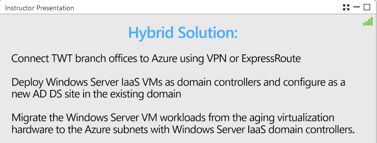
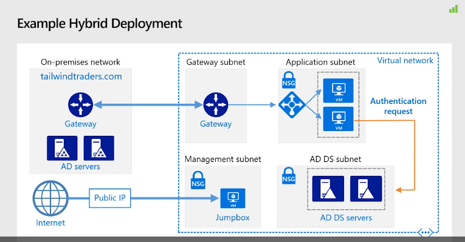
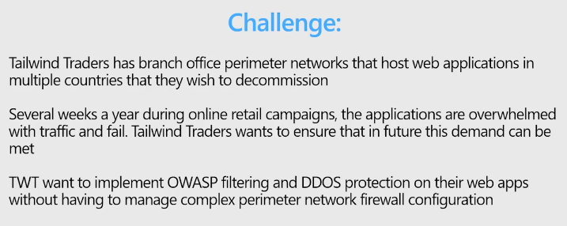
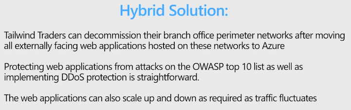
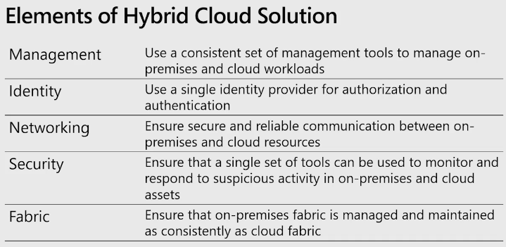
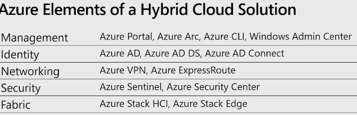
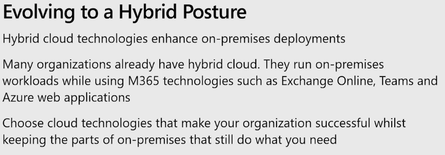
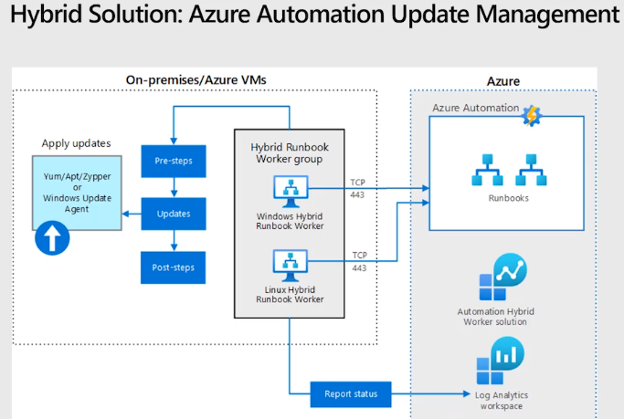
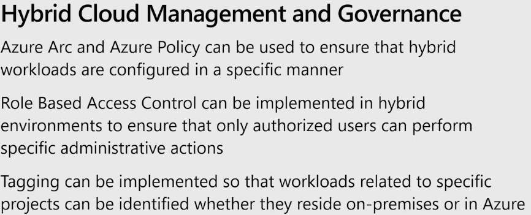
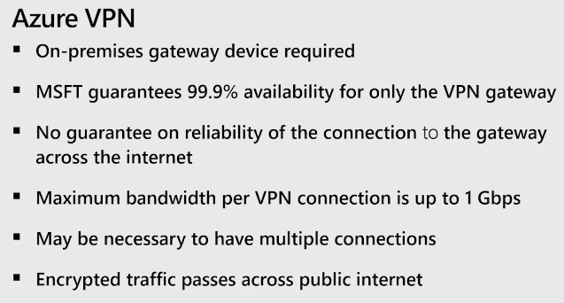
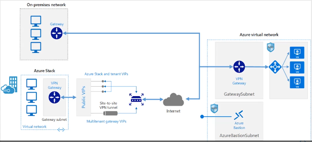
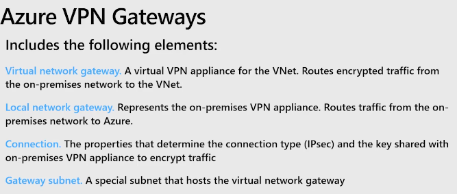
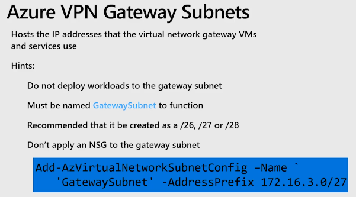
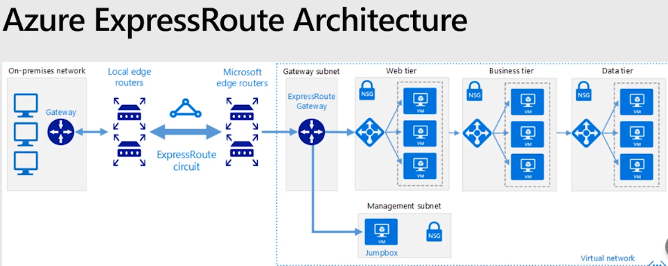

[<< home](../az.md) | [< back](../lectures.md)

[1]: https://azure.microsoft.com/en-gb/overview/azure-stack/
[2]: https://docs.microsoft.com/en-gb/azure/architecture/solution-ideas/articles/hybrid-identity
[3]: https://docs.microsoft.com/en-gb/azure/virtual-wan/virtual-wan-about
[4]: https://docs.microsoft.com/en-gb/azure/architecture/reference-architectures/hybrid-networking/
[5]: https://docs.microsoft.com/en-gb/azure/architecture/browse/?azure_categories=hybrid
[6]: https://docs.microsoft.com/en-gb/learn/azure/
[7]: https://docs.microsoft.com/en-gb/azure/architecture/hybrid/hybrid-server-os-mgmt
[8]: https://docs.microsoft.com/en-gb/azure/architecture/hybrid/azure-arc-hybrid-config
[9]: https://docs.microsoft.com/en-gb/azure-stack/hci/overview
[10]: https://docs.microsoft.com/en-gb/azure/architecture/hybrid/hybrid-file-services
[11]: https://docs.microsoft.com/en-gb/azure/backup/backup-overview
[12]: https://docs.microsoft.com/en-gb/azure/site-recovery/site-recovery-overview
[13]: https://docs.microsoft.com/en-gb/azure/azure-relay/relay-what-is-it
[14]: https://docs.microsoft.com/en-gb/azure/azure-arc/data/overview
[15]: https://docs.microsoft.com/en-gb/azure/azure-arc/kubernetes/overview
[16]: https://docs.microsoft.com/en-gb/azure/active-directory/app-proxy/application-proxy
[17]: https://docs.microsoft.com/en-gb/azure/app-service/app-service-hybrid-connections
