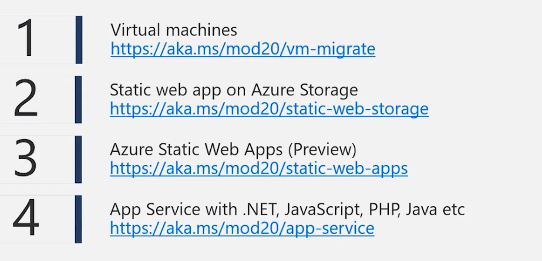
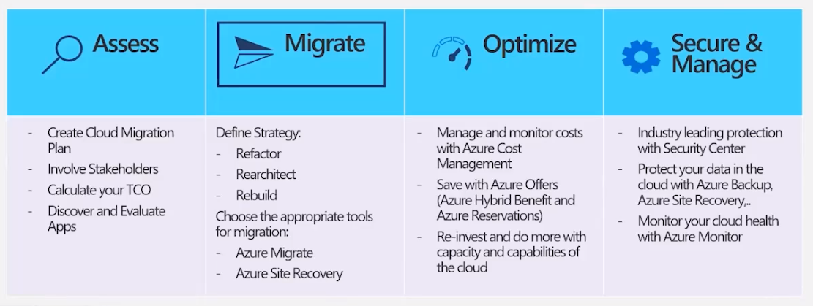

# Modernize .NET Apps

## q&a

> What's the difference between the azure region and the geography specified in the azure migrate drop down (when migrating a web app)?

Azure regions are organized into geographies. An [Azure geography](https://azure.microsoft.com/en-us/global-infrastructure/geographies/) ensures that data residency, sovereignty, compliance, and resiliency requirements are [honored within geographical boundaries](https://azure.microsoft.com/en-us/global-infrastructure/data-residency/#overview).

> Related to data residency. Say my resource goup is in the North Europe region. I start using the web app migrator. I choose Europe geography. Does this mean the actual app could be physically hosted in West Europe?

When you do a data migration, you will select the exact Azure Region where data will be copied. If you want you can run the app in another region, but you need to take into account if you are allowed from the legal/compliancy point of view to have data in that geographical regions / countries.

## web app hosting

## migration journey

## azure resource manager architecture

[<< home](../az.md) | [< back](../lectures.md)
