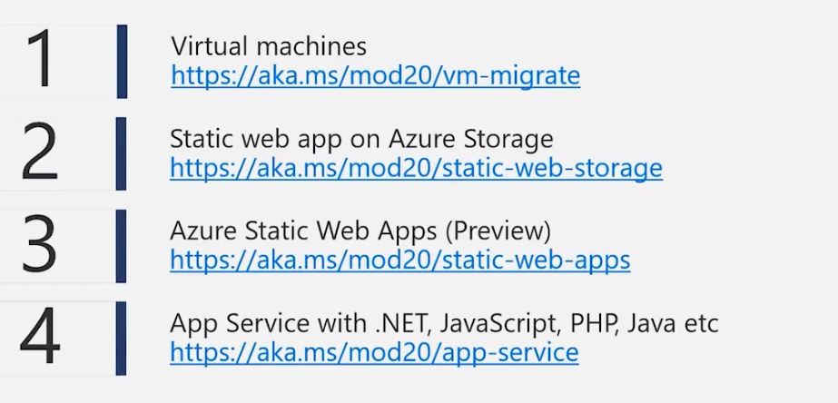
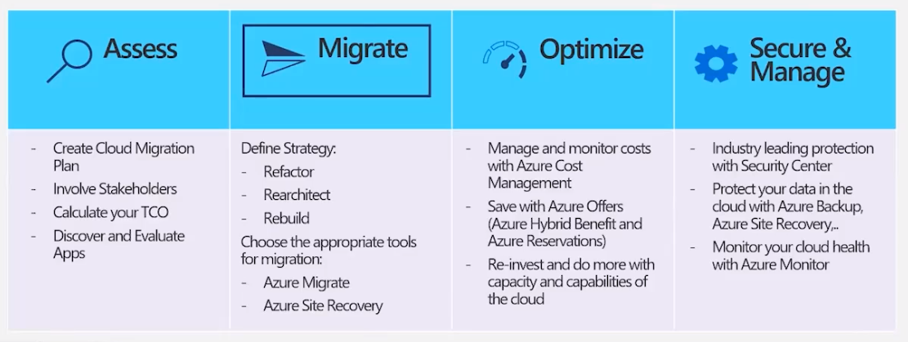

# Modernize .NET Apps

## Q&a

> What's the difference between the azure region and the geography specified in the azure migrate drop down (when migrating a web app)?

Azure regions are organized into geographies. An Azure geography [1] ensures that data residency, sovereignty, compliance, and resiliency requirements are honored within geographical boundaries [2].

> Related to data residency. Say my resource goup is in the North Europe region. I start using the web app migrator. I choose Europe geography. Does this mean the actual app could be physically hosted in West Europe?

When you do a data migration, you will select the exact Azure Region where data will be copied. If you want you can run the app in another region, but you need to take into account if you are allowed from the legal/compliancy point of view to have data in that geographical regions / countries.

## Web App Hosting

## Migration Journey

## Azure Resource Manager Architecture

## Misc

- Azure migration center [3]
- `Azure Migrate` is a hub. _azure app service migration assistant_
- Migrate machines as physical servers to Azure [4]
- for sql db deownload `data migration assistant` small workloads
- for enterprise `database migration service`
- Features comparison: Azure SQL Database and Azure SQL Managed Instance [5]
- service broker [6] `SQL Server Service Broker` provide native support for messaging and queuing in the `SQL Server Database Engine` and `Azure SQL Managed Instance`. Developers can easily create sophisticated applications that use the Database Engine components to communicate between disparate databases, and build distributed and reliable applications.
- netcore portability analyzer (extension)

[<< home](../az.md) | [< back](../lectures.md)

[1]: https://azure.microsoft.com/en-us/global-infrastructure/geographies/
[2]: https://azure.microsoft.com/en-us/global-infrastructure/data-residency/#overview
[3]: https://azure.microsoft.com/en-us/migration/
[4]: https://docs.microsoft.com/en-us/azure/migrate/tutorial-migrate-physical-virtual-machines
[5]: https://docs.microsoft.com/en-us/azure/azure-sql/database/features-comparison
[6]: https://docs.microsoft.com/en-us/sql/database-engine/configure-windows/sql-server-service-broker?view=sql-server-ver15
