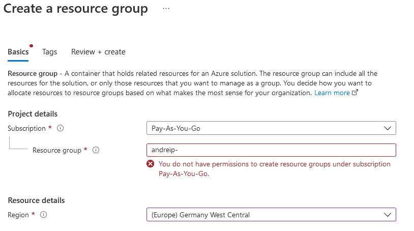

# Exercise - Protect a storage account from accidental deletion by using a resource lock

> https://docs.microsoft.com/en-us/learn/modules/build-cloud-governance-strategy-azure/4-protect-storage-account-resource-lock \
> You need your own Azure subscription to complete the exercises in this module. If you don't have an Azure subscription, you can still read along.

In this exercise, you see how resource locks help prevent accidental deletion of your Azure resources.

To do so, you create a resource group from the Azure portal.
Think of a resource group as a container for related Azure resources.
Then you add a lock to your resource group and verify that you can't delete the resource group.

You then add a storage account to your resource group and see how the lock from the parent resource group prevents the storage account from being deleted.
A storage account is a container that groups a set of Azure Storage services together.

## Here you create a resource group that's named my-test-rg.

- Go to the Azure portal and sign in.
- At the top of the page, select Resource groups.
- Select + New. The Create a resource group page appears.
- In the Basics tab, fill in the following fields.

Setting | Value
---|---
Project details | 
Subscription | Your Azure subscription
Resource group | my-test-rg
Resource details | 
Region | (US) East US. You can also select a region that's closer to you.

- Select Review + create, and then select Create.

## Add a lock to the resource group

Add a resource lock to the resource group. To do so:

- From the Azure portal, select your resource group, my-test-rg.
- Under Settings, select Locks, and then select Add.

- Fill in these fields. Lock name: `rg-delete-lock`, Lock type: `Delete`
- Select OK. You see that the resource lock is applied to your resource group.

## Verify that the resource group is protected from deletion

Here, you verify protection by attempting to delete the resource group.

id | desc | pic
---|---|---
1 | From the top of the page, select my-test-rg to go to your resource group's overview page. | 
2 | Select Delete resource group. | 
3 | At the prompt, enter my-test-rg, and then select OK. You see a message that tells you that the resource group is locked and can't be deleted. | 

## Protect a storage account from accidental deletion

Here, you add a storage account to your resource group and see how the lock from the parent resource group prevents the storage account from being deleted. To do so:

- From the Azure portal, at the top of the page, select Home to return to the start page.
- Select Storage accounts. Then select + New. The Create storage account page appears.
- In the Basics tab, fill in the following fields.

 Note

Replace NNN with a series of numbers. The numbers help to ensure that your storage account name is unique.

Setting | Value
---|---
Subscription | Your Azure subscription
Resource group | my-test-rg
Storage account name | mysaNNN
Location | (US) East US. As before, you can also select a region that's closer to you.
Performance | Standard
Account kind | StorageV2 (general purpose v2)
Replication | Locally redundant storage (LRS)

- Select Review + create, and then select Create. The deployment might take a few moments to complete.
- Select Go to resource.
- At the top of the page, select Delete.

You see a message that tells you the resource or its parent is locked and can't be deleted.
Here's an example that shows the error message for a storage account that's named mysa1234.

Although you didn't create a lock specifically for the storage account, the lock you created for the parent resource group prevents you from deleting the resource.
In other words, the storage account inherits the lock from the parent resource group.

## Delete the resource group and the storage account

You no longer need your resource group or storage account. Here you remove both.

When you delete a resource group, you also delete its child resources, such as the storage account you previously created.

To delete the resource group, you first need to remove the resource lock.

- From the Azure portal, select Home > Resource groups > my-test-rg to go to your resource group.
- Under Settings, select Locks.
- Locate rg-delete-lock, and select Delete on that same row.
- Select Overview, and then select Delete resource group.
- At the prompt, enter my-test-rg, and then select OK. The deletion operation might take a few moments to complete.
- When the operation completes, select Home > Resource groups.
You see that the my-test-rg resource group no longer exists in your account.
Your storage account is also deleted.

[< 5: Describe identity, governance, privacy, and compliance features](./5-lp-az-900.md)