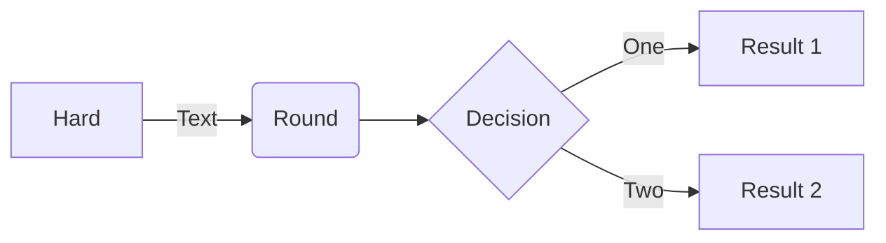
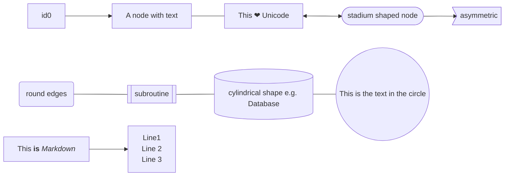
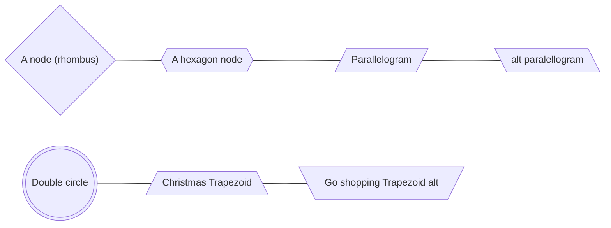
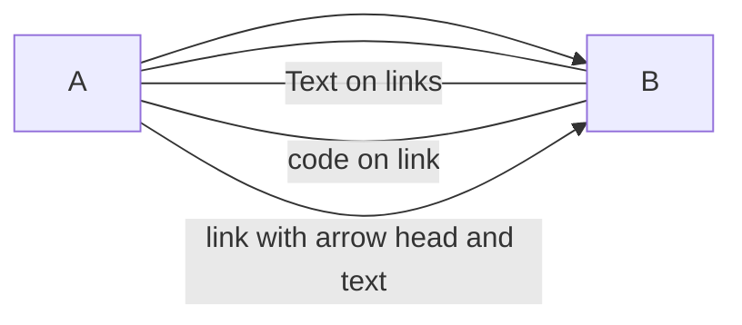
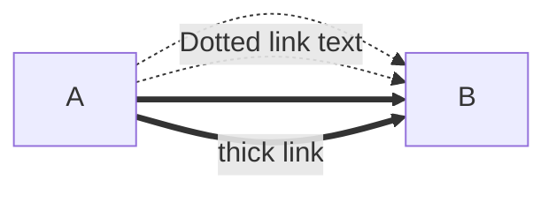
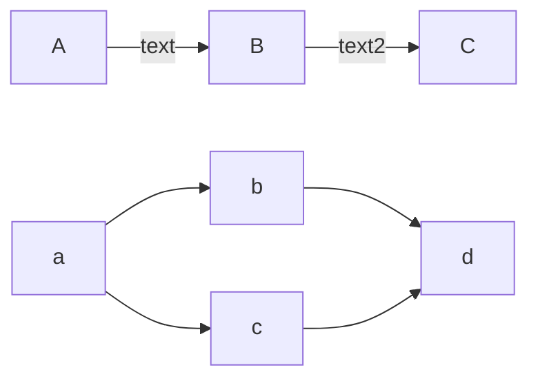
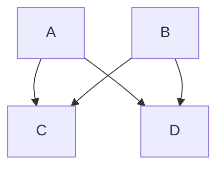
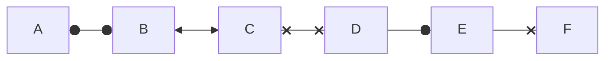
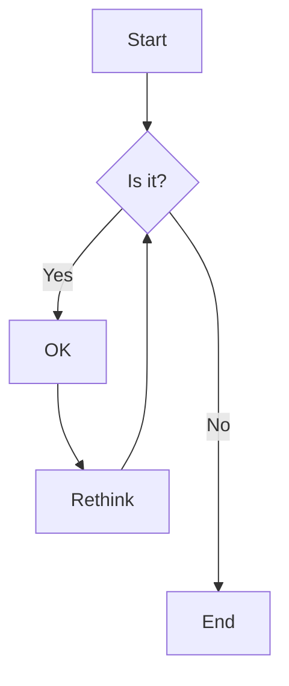

# Mermaid Flowcharts

> Nodes and edges

## Shapes

```mermaid
flowchart LR
    A[Hard] -->|Text| B(Round)
    B --> C{Decision}
    C -->|One| D[Result 1]
    C -->|Two| E[Result 2]
```

```mermaid
flowchart LR
    id0
    id1[A node with text]
    id2["This ❤ Unicode"]
    id3([stadium shaped node])
    id0-->id1---id2<-->id3-->id8
    id4(round edges)
    id5[[subroutine]]
    id6[(cylindrical shape e.g. Database)]
    id7((This is the text in the circle))
    id8>asymmetric]
    id4---id5---id6---id7

    markdown["`This **is** _Markdown_`"]
    newLines["`Line1
    Line 2
    Line 3`"]
    markdown --> newLines
```

```mermaid
flowchart LR
    id0{"A node (rhombus)"}
    id1{{A hexagon node}}
    id2[/Parallelogram/]
    id3[\alt paralellogram\]    
    id0---id1---id2---id3
    A[/Christmas Trapezoid\]
    B[\Go shopping Trapezoid alt/]
    id4(((Double circle)))
    id4---A---B
```

## Links

```mermaid
flowchart LR
    A-->B
    A --- B
    A-- Text on links ---B
    A---|code on link|B
    A-->|link with arrow head and text |B
```

```mermaid
flowchart LR
   A-.->B;
   A-. Dotted link text .-> B
   A ==> B
   A == thick link ==> B
   A ~~~ B
```

```mermaid
flowchart LR
   A -- text --> B -- text2 --> C
   a --> b & c--> d
```

```mermaid
flowchart TB
    A & B--> C & D
```

lagom

```mermaid
flowchart TB
    A --> C
    A --> D
    B --> C
    B --> D
```

```mermaid
flowchart LR
    A o--o B
    B <--> C
    C x--x D
    D --o E
    E --x F
```

```mermaid
flowchart TD
    A[Start] --> B{Is it?}
    B -->|Yes| C[OK]
    C --> D[Rethink]
    D --> B
    B ---->|No| E[End]
```

```mermaid
flowchart TD
    A[Start] --> B{Is it?}
    B -- Yes --> C[OK]
    C --> D[Rethink]
    D --> B
    B -- No ----> E[End]
```

[<](./index.md) | [<<](/index.md)
