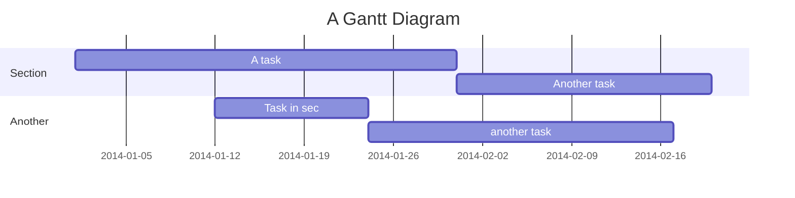
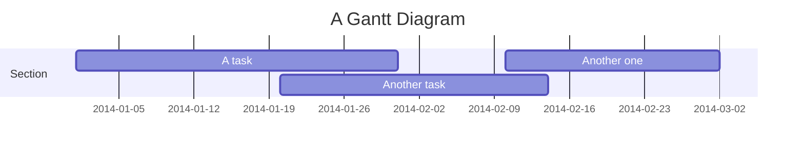
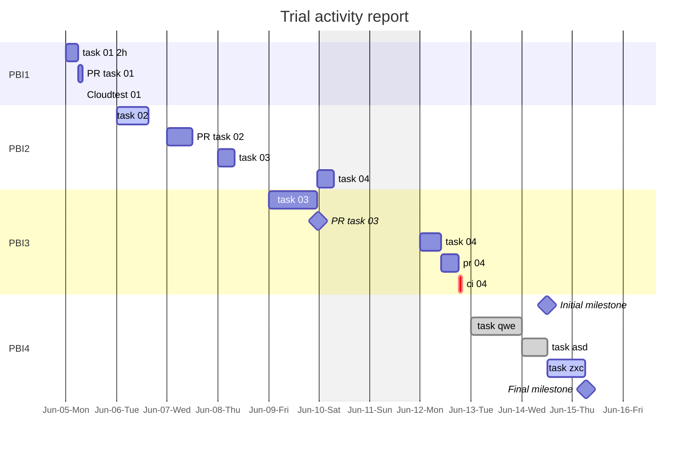

# Mermaid Gantt Charts

[Gantt chart syntax][1]

> Bar Chart

```mermaid
gantt
    title Git Issues - days since last update
    dateFormat X
    axisFormat %s
    section Issue19062
    71   : 0, 71
    section Issue19401
    36   : 0, 36
    section Issue193
    34   : 0, 34
    section Issue7441
    9    : 0, 9
    section Issue1300
    5    : 0, 5
```



> Comments need to be on their own line and must be prefaced with %%



> Compact display optimizes screen real estate



## Date Formats

type | format | def
--- | --- | ---
date | %c | date and time, as "%a %b %e %H:%M:%S %Y"
month | %B | full month name
month | %b | abbreviated month name
month | %m | month as a decimal number [01,12]
week | %U | week number of the year (Sunday as the first day of the week) as a decimal number [00,53]
week | %W | week number of the year (Monday as the first day of the week) as a decimal number [00,53]
weekday | %w | weekday as a decimal number [0(Sunday),6]
weekday | %A | full weekday name
day of month | %d | zero-padded day of the month as a decimal number [01,31]
day of month | %e | space-padded day of the month as a decimal number [ 1,31]; equivalent to %_d

## Trial Activity Report



## Time Tracking

```mermaid
---
displayMode: compact
---
gantt
    title Time Tracking
    dateFormat X
    axisFormat %s
    tickInterval 1
    section Issue19062
    code: 0, 2
    pr: 3, 4
    so: 5,8 
    section Issue19401
    code   : 0, 8
    pr   : 0, 8
    section Issue193
    code   : 0, 3
    pr: 4,8
    section Issue7441
    cloud : 0, 8
    test : 0, 8
    section Issue1300
    5    : 0, 5
```



## User Journey

```mermaid
journey
    title My working day
    actor code
    actor cloudtest

    section Task 01
      Code: 5: code
      CloudTest: 3: cloudtest
    section Task 02
      Code: 5: code
      CloudTest: 5: cloudtest
```

[<](./index.md) | [<<](/index.md)

[1]: https://mermaid.js.org/syntax/gantt.html
