# Mermaid Sequence Diagrams

> [Actor][Arrow][Actor]:Message text

## Arrows

Type|Description
---|---
`->` | Solid line without arrow
`-->` | Dotted line without arrow
`->>` | Solid line with arrowhead
`-->>` | Dotted line with arrowhead
`-x` | Solid line with a cross at the end
`--x`	| Dotted line with a cross at the end.
`-)` | Solid line with an open arrow at the end (`async`)
`--)` | Dotted line with a open arrow at the end (`async`)

## Samples

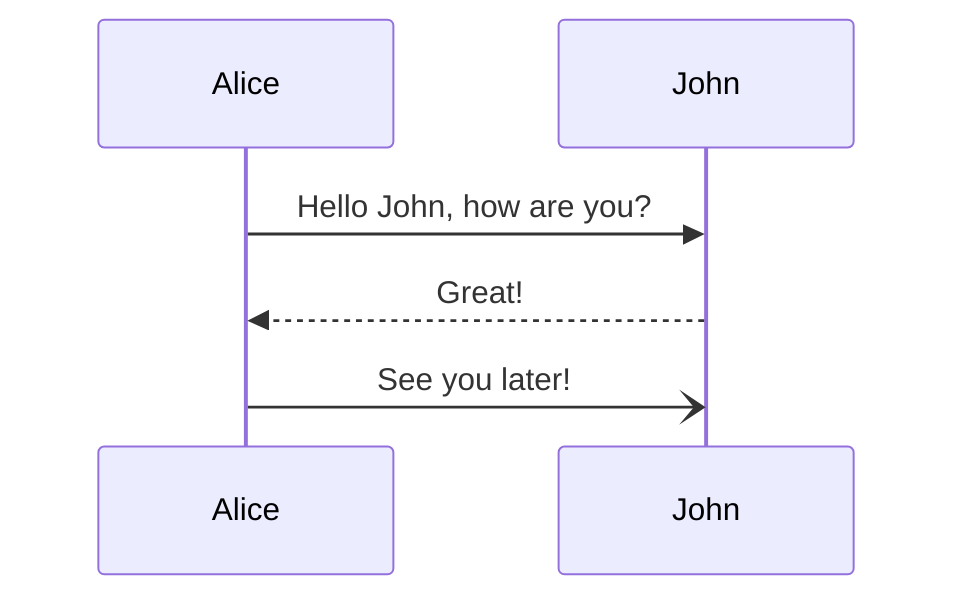

> Participants

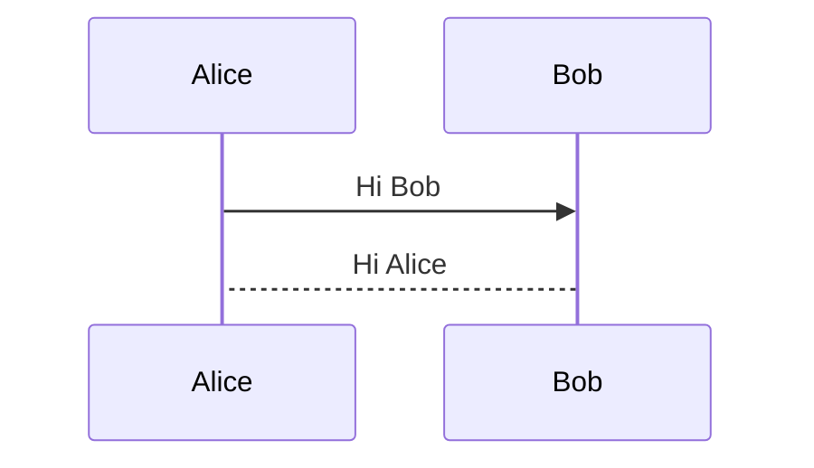

> Actors

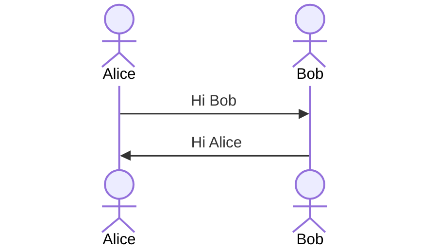

> Alias

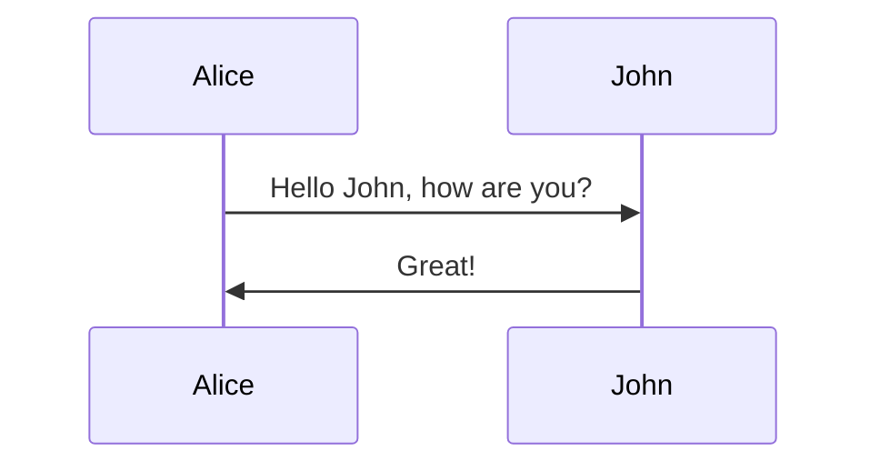

> Group

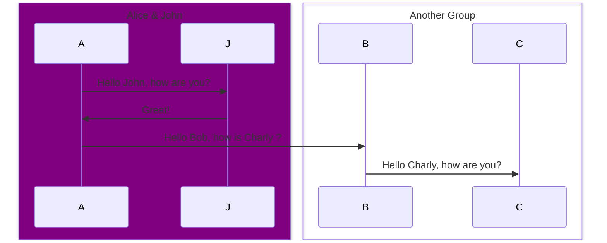

> Activations

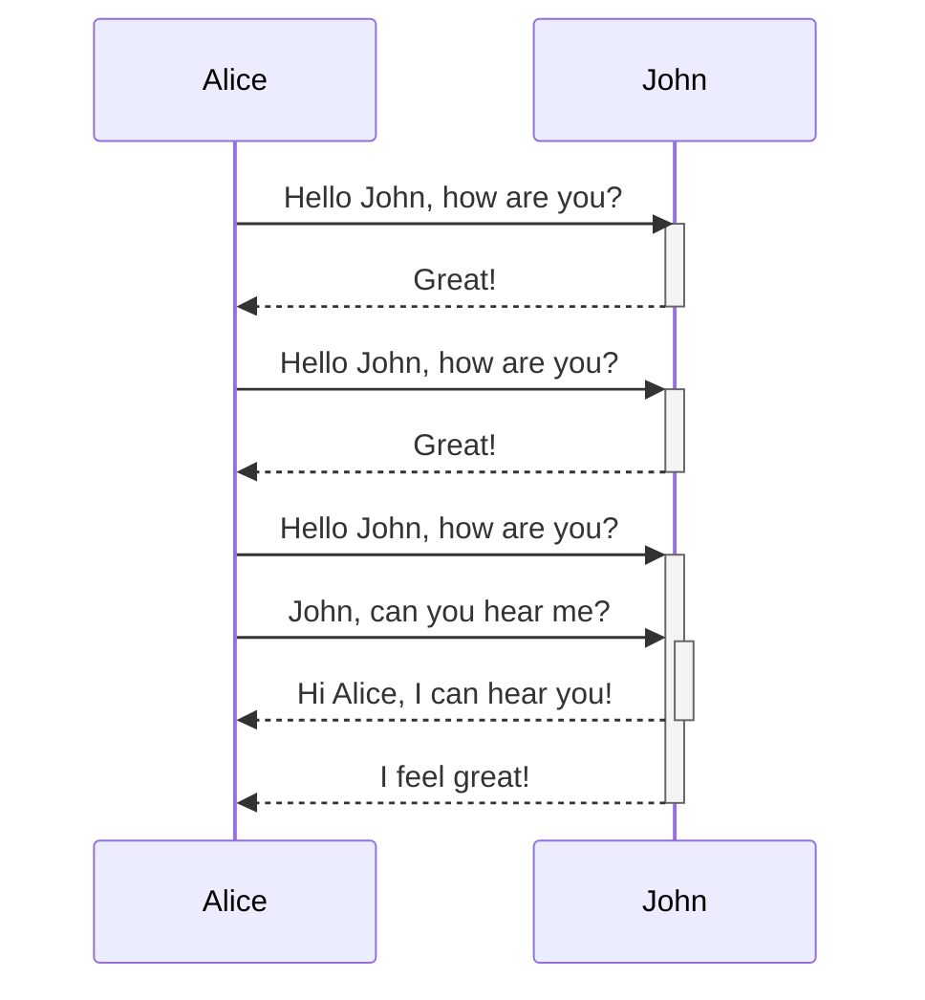

> Notes

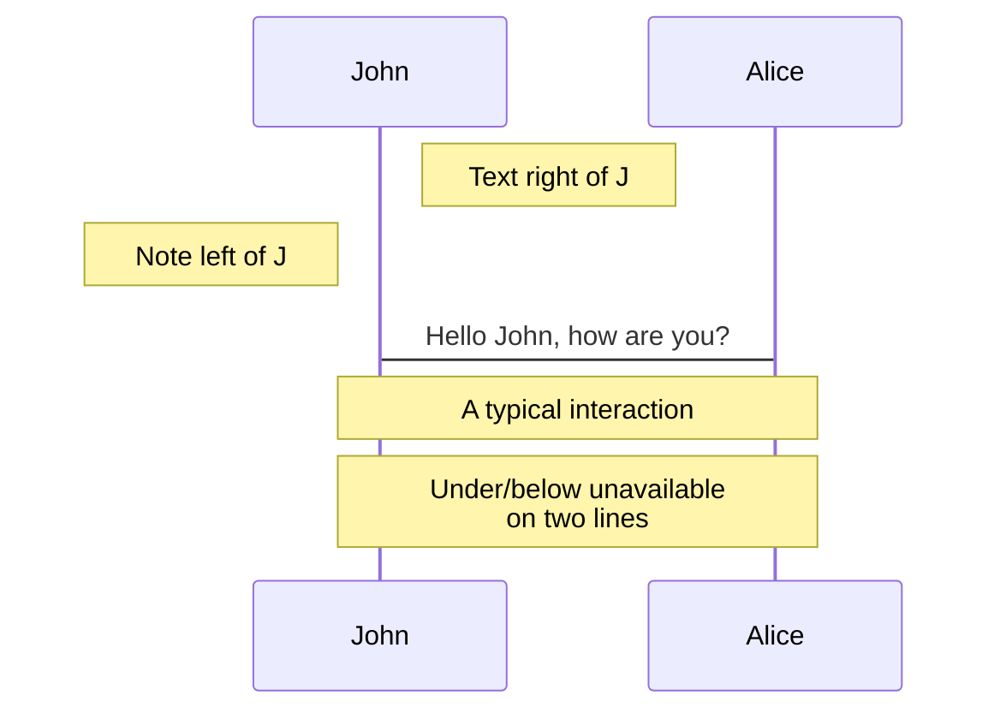

> Loop

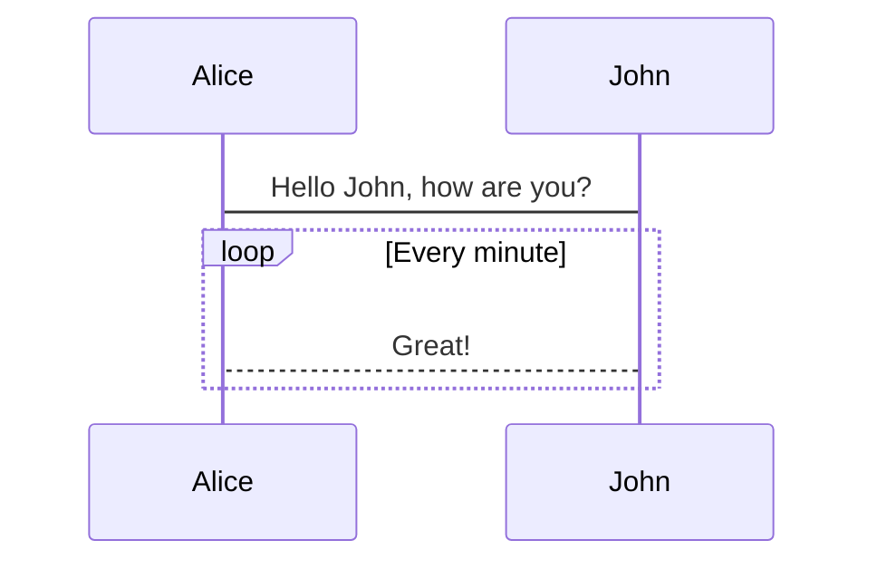

> Alternative Paths

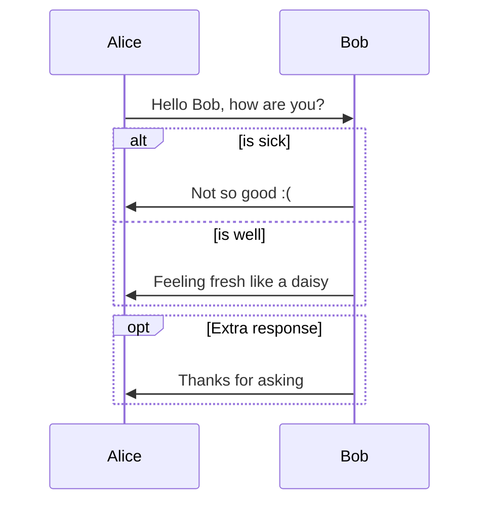

> Parallel

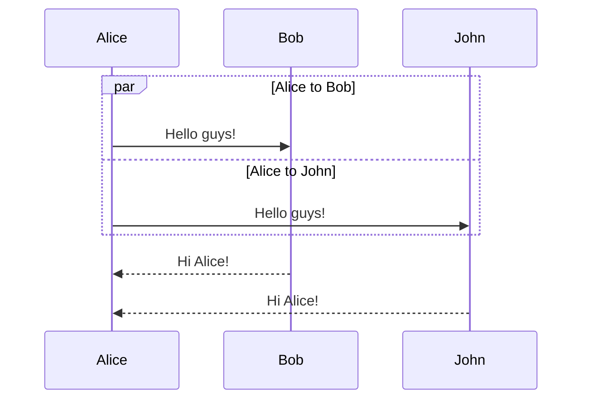

> Nested

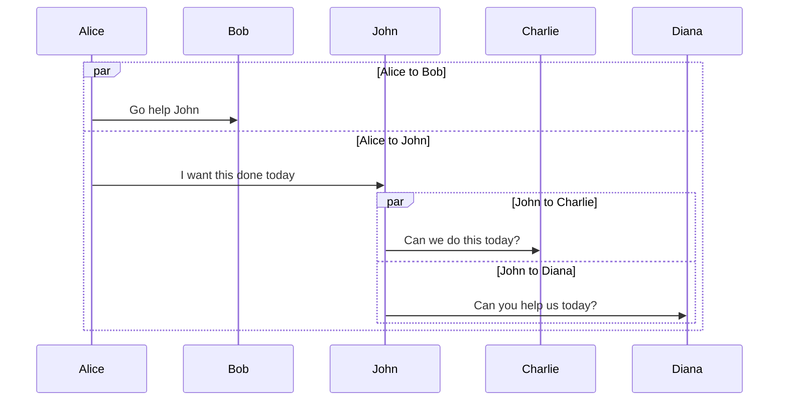

> Critical Region

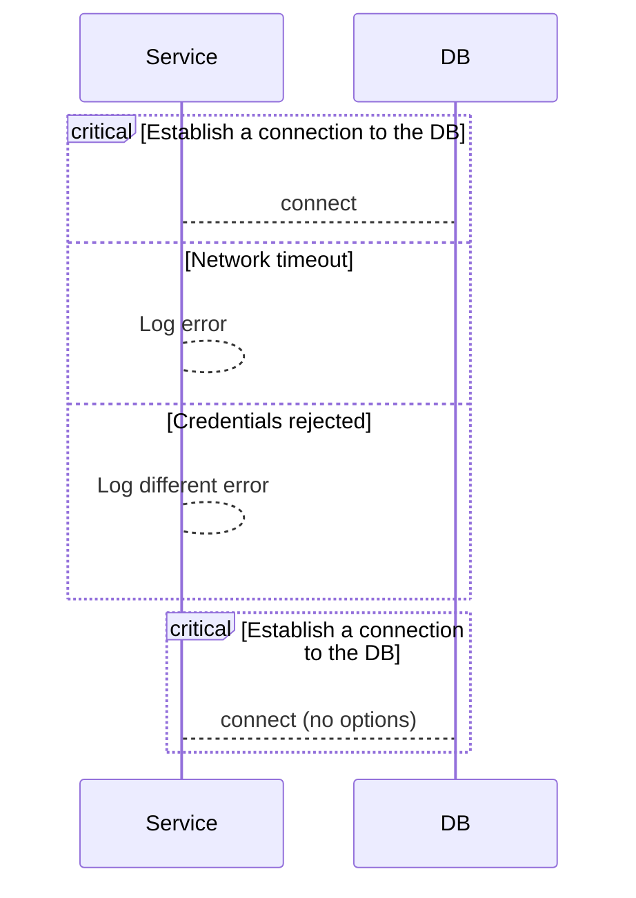

> Break

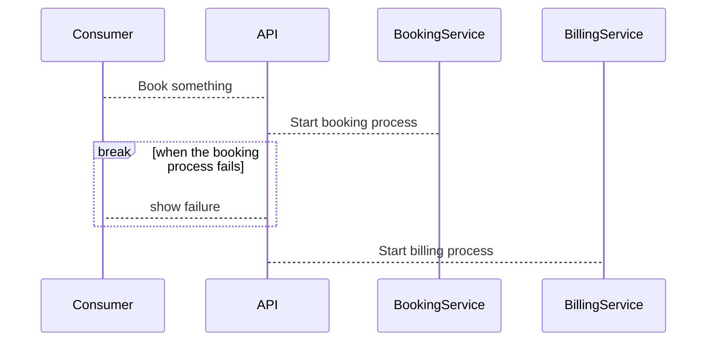

> Background Highlighting

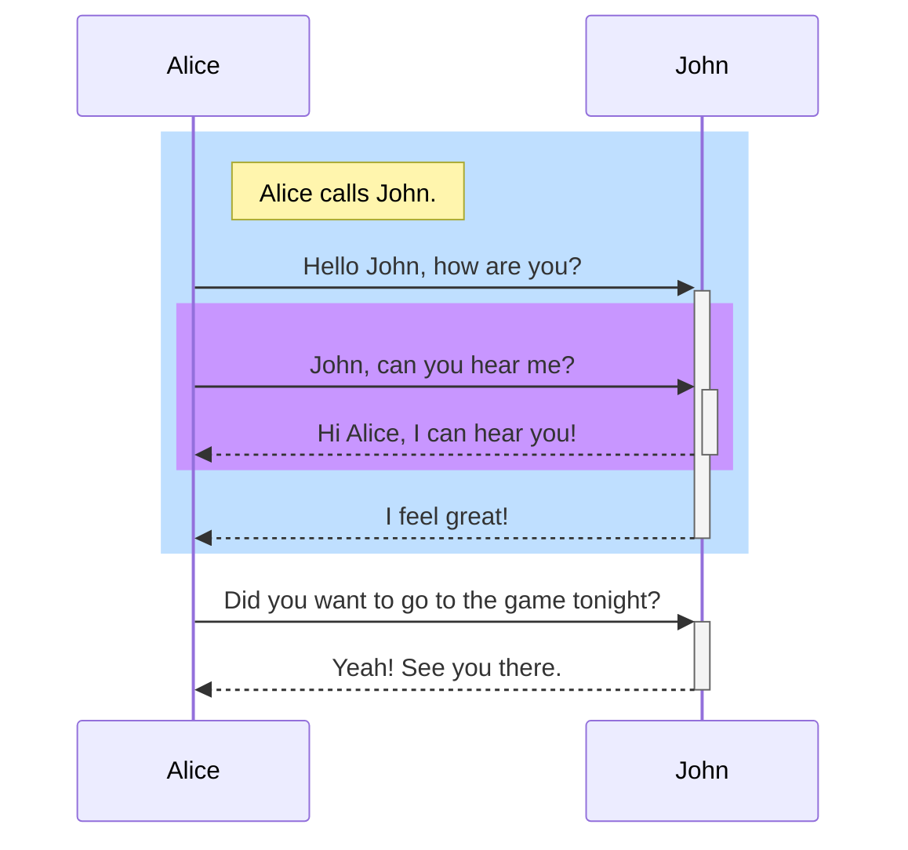

> Autonumber

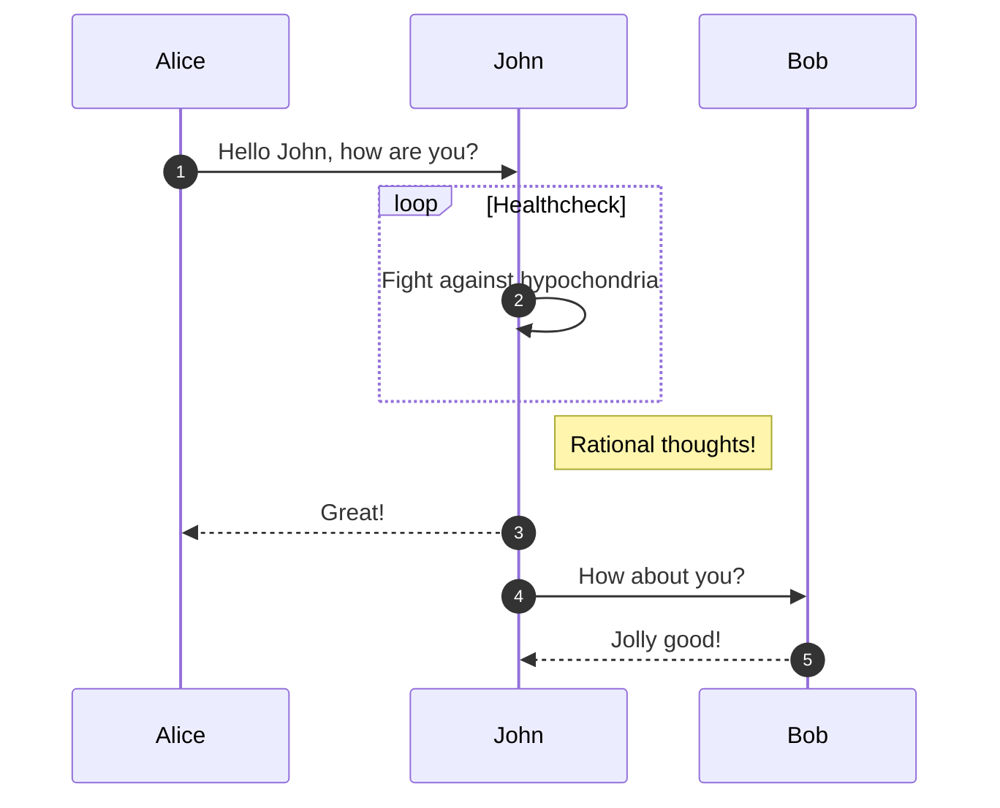

[<](./index.md) | [<<](/index.md)
