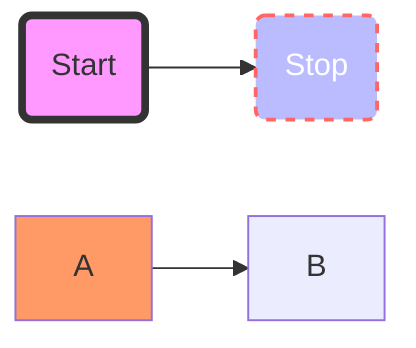
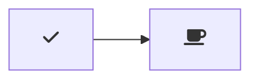
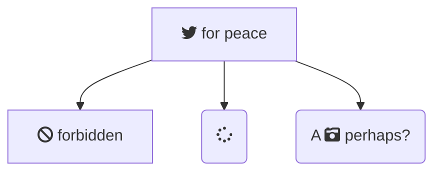

# Mermaid Style

> Node styling, CSS classes, and Font Awesome icons

```mermaid
flowchart LR
    id1(Start)-->id2(Stop)
    style id1 fill:#f9f,stroke:#333,stroke-width:4px
    style id2 fill:#bbf,stroke:#f66,stroke-width:2px,color:#fff,stroke-dasharray: 5 5
    A:::someclass --> B
    classDef someclass fill:#f96
```

## Font Awesome

```mermaid
graph LR
    fa:fa-check-->fa:fa-coffee
```

```mermaid
flowchart TD
    B["fab:fa-twitter for peace"]
    B-->C[fa:fa-ban forbidden]
    B-->D(fa:fa-spinner)
    B-->E(A fa:fa-camera-retro perhaps?)
```

[<](./index.md) | [<<](/index.md)
