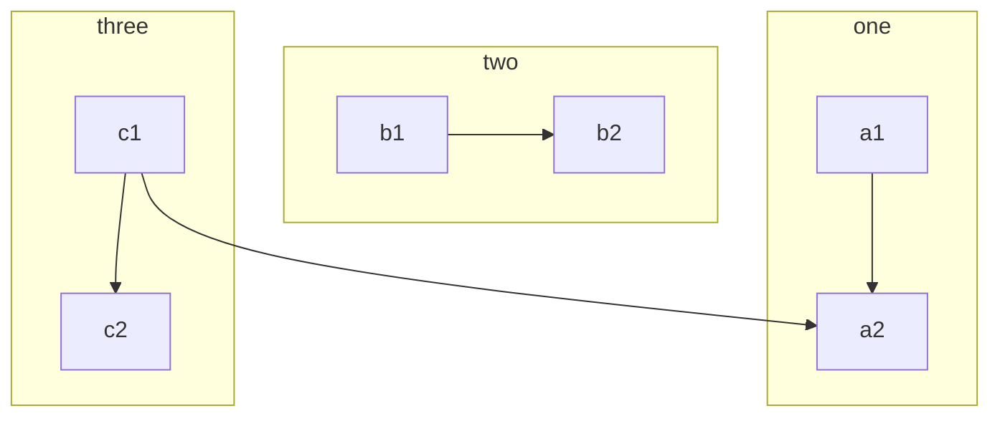
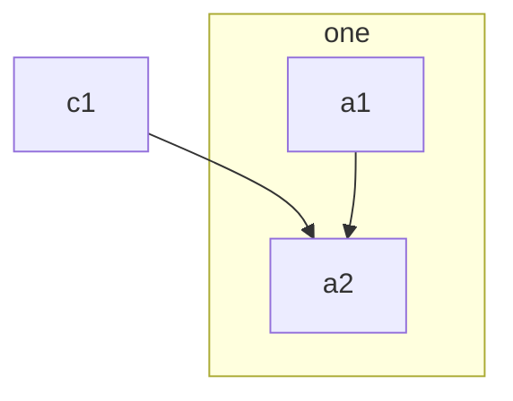
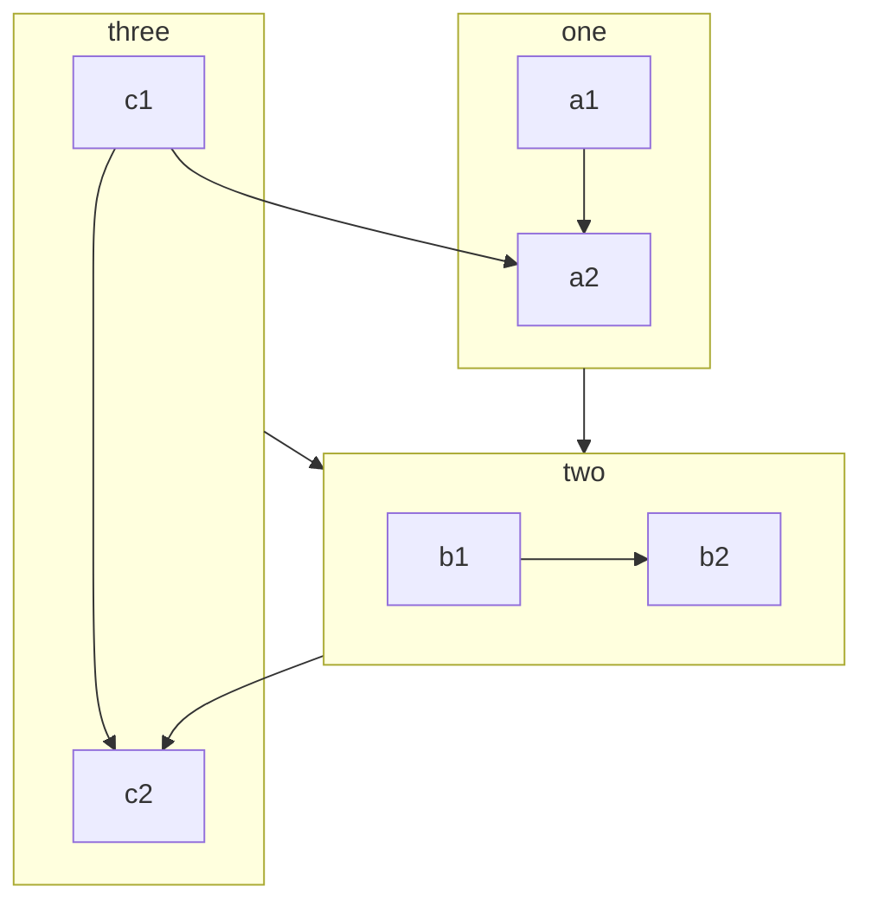
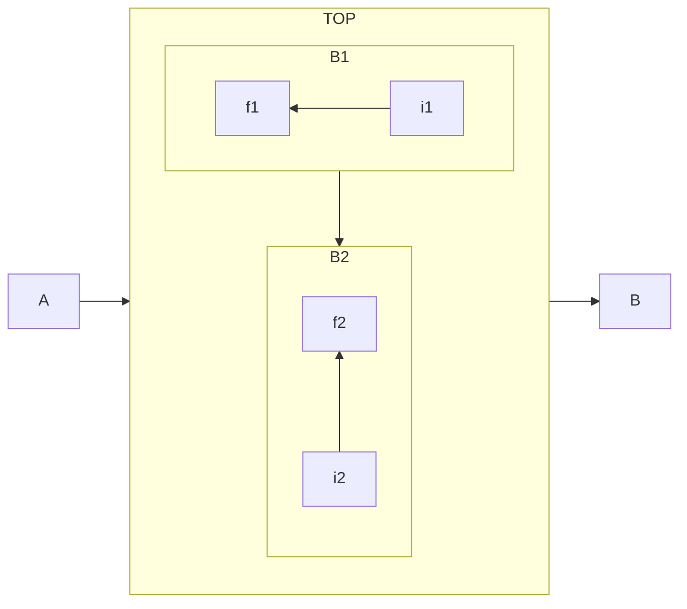
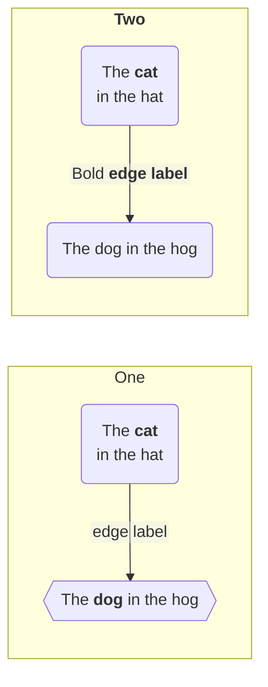
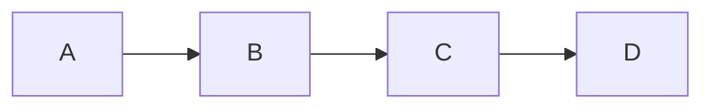
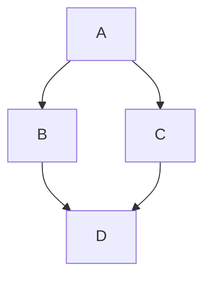
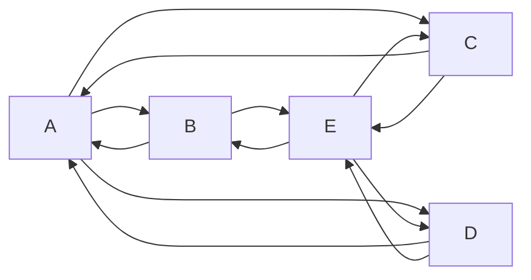
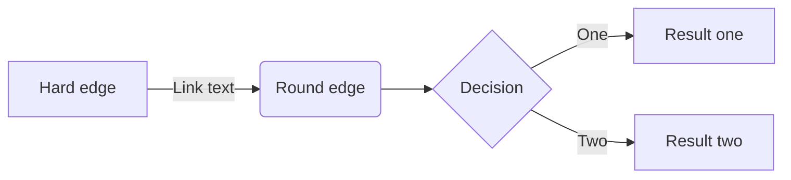

# Mermaid Subgraphs

> Flowcharts with subgraphs

> Explicit id for the subgraph

> With the graphtype flowchart it is also possible to set edges to and from subgraphs

> Direction in Subgraphs

> Markdown Strings

> Tooltip

## Graphs

[<](./index.md) | [<<](/index.md)
