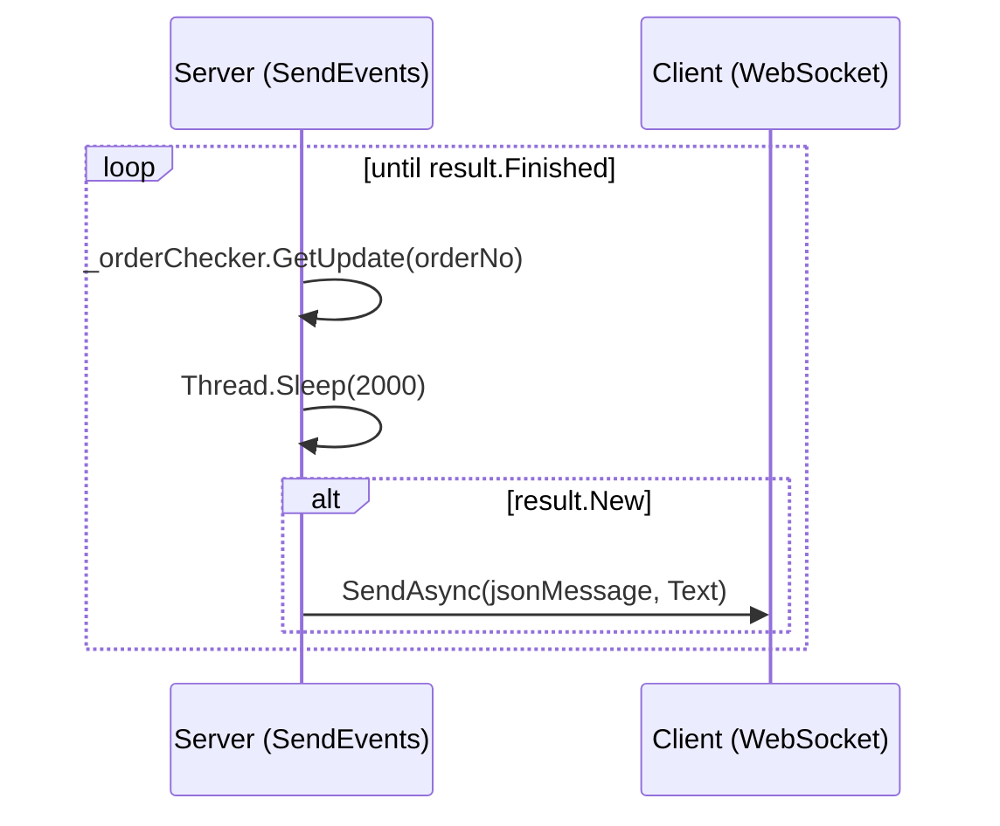
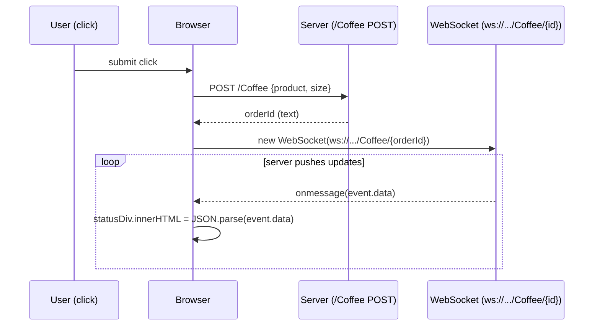

# Websockets

- Full duplex messaging
- No 6 connection limit
- Multi data-type support
- **TCP** socket upgrade: A standardized way to use one TCP socket through which messages can be sent from server to client and vice versa.
- WS protocol

## Microsoft.AspNetCore.WebSockets

- Contains a managed implementation of the WebSocket protocol, along with server integration components.
- `Microsoft.AspNetCore.WebSockets`
- `Microsoft.AspNetCore.WebSockets.Protocol`
- `Microsoft.AspNetCore.WebSockets.Server`
- `Microsoft.AspNetCore.WebSockets.Test.WebSocketMiddlewareTests` src [1]
- middleware src [2] and tests src [1]
- _Using WebSockets in ASP.NET Core_ blog [3] June, 2016
- _Websockets in Asp.Net Core_ blog [4] July 2018
- _Archived_ Implementation of the WebSocket protocol for aspnet [5], along with client and server integration components.
- asp net core api
  - configure `app.UseWebSockets(new WebSocketOptions{ KeepAliveInterval = TimeSpan.FromSeconds(120), ReceiveBufferSize = 4*1024 })`
  - controller

  ```cs
    var context = _httpContextAccessor.HttpContext;
    if (context.WebSockets.IsWebSocketRequest)
    {
        var ws = await context.WebSockets.AcceptWebSocketAsync();
        await SendEvents(ws, params object[] ...)
        await ws.CloseAsync(WebSocketCloseStatus.NormalClosure, "done", CancellationToken.None);
    }
    else
    {
        context.Response.StatusCode = 400;
    }
  ```

**`SendEvents` — server-side async loop (C#)**

```csharp
private async Task SendEvents(WebSocket webSocket, int orderNo)
{
    CheckResult result;

    do
    {
        result = _orderChecker.GetUpdate(orderNo);
        Thread.Sleep(2000);

        if (!result.New) continue;

        var jsonMessage = $"\"{result.Update}\"";
        await webSocket.SendAsync(
            buffer: new ArraySegment<byte>(
                array: Encoding.ASCII.GetBytes(jsonMessage),
                offset: 0,
                count: jsonMessage.Length),
            messageType: WebSocketMessageType.Text,
            endOfMessage: true,
            cancellationToken: CancellationToken.None);

    } while (!result.Finished);
}
```



- javascript — the client opens a WebSocket to receive updates, then POSTs via `fetch` and pipes the response into the listener:

```js
const listen = (id) => {
    const socket = new WebSocket(`ws://localhost:60907/Coffee/${id}`);

    socket.onmessage = event => {
        const statusDiv = document.getElementById("status");
        statusDiv.innerHTML = JSON.parse(event.data);
    };
};

document.getElementById("submit").addEventListener("click", e => {
    e.preventDefault();
    const product = document.getElementById("product").value;
    const size    = document.getElementById("size").value;

    fetch("/Coffee", {
        method: "POST",
        body: { product, size }
    })
    .then(response => response.text())
    .then(text => listen(text));
});
```



## Browser

- The WebSocket [6] _browser_ API.
- The WebSocket API is an advanced technology that makes it possible to open a _two-way interactive communication session_ between the user's browser and a server. With this API, you can send messages to a server and _receive event-driven responses_ **without having to poll the server for a reply**.
- Bringing Sockets to the Web [7] 2010
- desktop to web socket [8] 2012

## SignalR

[`SignalR`](signalr.md) [](signalr.md)

## Misc

- SuperWebSocket [9] A .NET server side implementation of WebSocket protocol. repo [10] _SuperWebSocket is a .NET implementation of WebSocket server_. supersocket [11] an extensible socket server framework, telnet example [12]
- C# Websockets for all platforms using native bridges NVentimiglia/Websockets.PCL [13]
- Building **Real-time** Web Apps with ASP .NET `WebAPI` and `WebSockets` blog article [14] July 17, 2012
- `Microsoft.AspNetCore.Http.WebSocketManager` src [15]
- `Microsoft.AspNetCore.TestHost.WebSocketClient` src [16]

## Radu Matei

- Simple middlware for real-time .NET Core samples [17]
- blog [18]

[1]: https://github.com/aspnet/AspNetCore/blob/7fb3d57f54bc8351e725fb936f15c5fec8dca06c/src/Middleware/WebSockets/test/UnitTests/WebSocketMiddlewareTests.cs
[2]: https://github.com/aspnet/AspNetCore/blob/7fb3d57f54bc8351e725fb936f15c5fec8dca06c/src/Middleware/WebSockets/src/WebSocketMiddleware.cs
[3]: https://dotnetthoughts.net/using-websockets-in-aspnet-core/
[4]: http://zbrad.github.io/tools/wscore/
[5]: https://github.com/aspnet/websockets
[6]: https://developer.mozilla.org/en-US/docs/Web/API/WebSockets_API
[7]: https://www.html5rocks.com/en/tutorials/websockets/basics/
[8]: https://isolasoftware.it/2012/05/04/how-to-send-live-data-from-a-c-desktop-application-to-web-using-websockets/
[9]: https://archive.codeplex.com/?p=superwebsocket
[10]: https://github.com/kerryjiang/SuperWebSocket
[11]: http://www.supersocket.net/
[12]: http://docs.supersocket.net/v2-0/en-US/A-Telnet-Example
[13]: https://github.com/NVentimiglia/Websockets.PCL
[14]: https://blogs.msdn.microsoft.com/youssefm/2012/07/17/building-real-time-web-apps-with-asp-net-webapi-and-websockets/
[15]: https://github.com/aspnet/AspNetCore/blob/425c196cba530b161b120a57af8f1dd513b96f67/src/Http/Http.Abstractions/src/WebSocketManager.cs
[16]: https://github.com/aspnet/AspNetCore/blob/1f892d798d3163b4bd9d3c4e900f6bb5c2310f9c/src/Hosting/TestHost/src/WebSocketClient.cs
[17]: https://github.com/radu-matei/websocket-manager/tree/master/samples
[18]: https://radu-matei.com/blog/aspnet-core-websockets-middleware/

## Echo Sample

Official ASP.NET Core WebSocket echo sample [19].

### wwwroot/index.html

```html
<!DOCTYPE html>
<html>
<head>
    <meta charset="utf-8" />
    <title></title>
    <style>
        table { border: 0 }
        .commslog-data { font-family: Consolas, Courier New, Courier, monospace; }
        .commslog-server { background-color: red; color: white }
        .commslog-client { background-color: green; color: white }
    </style>
</head>
<body>
    <h1>WebSocket Sample Application</h1>
    <p id="stateLabel">Ready to connect...</p>
    <div>
        <label for="connectionUrl">WebSocket Server URL:</label>
        <input id="connectionUrl" />
        <button id="connectButton" type="submit">Connect</button>
    </div>
    <p></p>
    <div>
        <label for="sendMessage">Message to send:</label>
        <input id="sendMessage" disabled />
        <button id="sendButton" type="submit" disabled>Send</button>
        <button id="closeButton" disabled>Close Socket</button>
    </div>
    <h2>Communication Log</h2>
    <table style="width: 800px">
        <thead><tr><td style="width: 100px">From</td><td style="width: 100px">To</td><td>Data</td></tr></thead>
        <tbody id="commsLog"></tbody>
    </table>
    <script>
        var connectionUrl = document.getElementById("connectionUrl");
        var connectButton = document.getElementById("connectButton");
        var stateLabel    = document.getElementById("stateLabel");
        var sendMessage   = document.getElementById("sendMessage");
        var sendButton    = document.getElementById("sendButton");
        var commsLog      = document.getElementById("commsLog");
        var closeButton   = document.getElementById("closeButton");
        var socket;

        var scheme = document.location.protocol === "https:" ? "wss" : "ws";
        var port   = document.location.port ? (":" + document.location.port) : "";
        connectionUrl.value = scheme + "://" + document.location.hostname + port + "/ws";

        function updateState() {
            function disable() { sendMessage.disabled = sendButton.disabled = closeButton.disabled = true; }
            function enable()  { sendMessage.disabled = sendButton.disabled = closeButton.disabled = false; }
            connectionUrl.disabled = connectButton.disabled = true;
            if (!socket) { disable(); return; }
            switch (socket.readyState) {
                case WebSocket.CLOSED:    stateLabel.innerHTML = "Closed";      disable(); connectionUrl.disabled = connectButton.disabled = false; break;
                case WebSocket.CLOSING:   stateLabel.innerHTML = "Closing...";  disable(); break;
                case WebSocket.CONNECTING:stateLabel.innerHTML = "Connecting...";disable(); break;
                case WebSocket.OPEN:      stateLabel.innerHTML = "Open";        enable();  break;
                default: stateLabel.innerHTML = "Unknown: " + htmlEscape(socket.readyState); disable();
            }
        }

        closeButton.onclick = function () { socket.close(1000, "Closing from client"); };

        sendButton.onclick = function () {
            var data = sendMessage.value;
            socket.send(data);
            commsLog.innerHTML += '<tr><td class="commslog-client">Client</td><td class="commslog-server">Server</td><td class="commslog-data">' + htmlEscape(data) + '</td></tr>';
        };

        connectButton.onclick = function () {
            stateLabel.innerHTML = "Connecting";
            socket = new WebSocket(connectionUrl.value);
            socket.onopen  = function (e) { updateState(); commsLog.innerHTML += '<tr><td colspan="3" class="commslog-data">Connection opened</td></tr>'; };
            socket.onclose = function (e) { updateState(); commsLog.innerHTML += '<tr><td colspan="3" class="commslog-data">Connection closed. Code: ' + htmlEscape(e.code) + '. Reason: ' + htmlEscape(e.reason) + '</td></tr>'; };
            socket.onerror   = updateState;
            socket.onmessage = function (e) { commsLog.innerHTML += '<tr><td class="commslog-server">Server</td><td class="commslog-client">Client</td><td class="commslog-data">' + htmlEscape(e.data) + '</td></tr>'; };
        };

        function htmlEscape(str) {
            return str.toString().replace(/&/g,'&amp;').replace(/"/g,'&quot;').replace(/'/g,'&#39;').replace(/</g,'&lt;').replace(/>/g,'&gt;');
        }
    </script>
</body>
</html>
```

### WebSocketController.cs

High-performance logging with `LoggerMessage.Define` and `[LoggerMessage]` source generator [20]:

```csharp
// High-perf structured logging via LoggerMessage.Define
internal static class HighPerfLog
{
    private static readonly Action<ILogger, Exception?> s_ctor =
        LoggerMessage.Define(LogLevel.Debug, new EventId(0, "WebSocketController ctor"),
            "The WebSocket class allows applications to send and receive data after the WebSocket upgrade has completed.");

    public static void Ctor(this ILogger logger) => s_ctor(logger, null!);

    private static readonly Action<ILogger, WebSocketCloseStatus?, string?, TimeSpan, WebSocketState, string?, Exception?>
        s_acceptWebSocketAsync = LoggerMessage.Define<WebSocketCloseStatus?, string?, TimeSpan, WebSocketState, string?>(
            LogLevel.Information, new EventId(1, "AcceptWebSocketAsync"),
            "[{CloseStatus}], Description: {CloseStatusDescription}, KeepAlive: {DefaultKeepAliveInterval}, State: {State}, SubProtocol: {SubProtocol}");

    public static void AcceptWebSocketAsync(this ILogger logger, WebSocket ws) =>
        s_acceptWebSocketAsync(logger, ws.CloseStatus, ws.CloseStatusDescription,
            WebSocket.DefaultKeepAliveInterval, ws.State, ws.SubProtocol, null!);
}

// Source-generator approach ([LoggerMessage] attribute)
public static partial class HighPerfCodeGenLog
{
    [LoggerMessage(EventId = 10, Level = LogLevel.Critical,
        Message = "Closing web socket [{CloseStatus}], Description: {CloseStatusDescription}")]
    public static partial void CompileTime(ILogger logger,
        WebSocketCloseStatus? closeStatus, string? closeStatusDescription);
}

// Controller
public class WebSocketController : ControllerBase
{
    readonly ILogger _logger;

    public WebSocketController(ILoggerFactory loggerFactory)
    {
        _logger = loggerFactory.CreateLogger("WS");
        _logger.Ctor();
    }

    [Route("/ws")]
    public async Task Get()
    {
        if (HttpContext.WebSockets.IsWebSocketRequest)
        {
            using var webSocket = await HttpContext.WebSockets.AcceptWebSocketAsync();
            _logger.AcceptWebSocketAsync(webSocket);
            await Echo(webSocket);
        }
        else HttpContext.Response.StatusCode = StatusCodes.Status400BadRequest;
    }

    async Task Echo(WebSocket webSocket)
    {
        var buffer = new byte[1024 * 4];
        var receiveResult = await webSocket.ReceiveAsync(new ArraySegment<byte>(buffer), CancellationToken.None);

        while (!receiveResult.CloseStatus.HasValue)
        {
            await webSocket.SendAsync(new ArraySegment<byte>(buffer, 0, receiveResult.Count),
                receiveResult.MessageType, receiveResult.EndOfMessage, CancellationToken.None);
            receiveResult = await webSocket.ReceiveAsync(new ArraySegment<byte>(buffer), CancellationToken.None);
        }

        await webSocket.CloseAsync(receiveResult.CloseStatus.Value,
            receiveResult.CloseStatusDescription, CancellationToken.None);
        HighPerfCodeGenLog.CompileTime(_logger, receiveResult.CloseStatus, receiveResult.CloseStatusDescription);
    }
}
```

[19]: https://github.com/dotnet/AspNetCore.Docs/blob/main/aspnetcore/fundamentals/websockets/samples/8.x/WebSocketsSample/Controllers/WebSocketController.cs
[20]: https://learn.microsoft.com/en-us/aspnet/core/fundamentals/logging/?view=aspnetcore-10.0

[<](./index.md) | [<<](/index.md)
