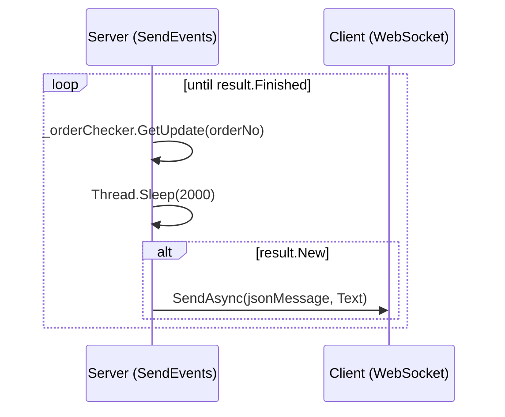
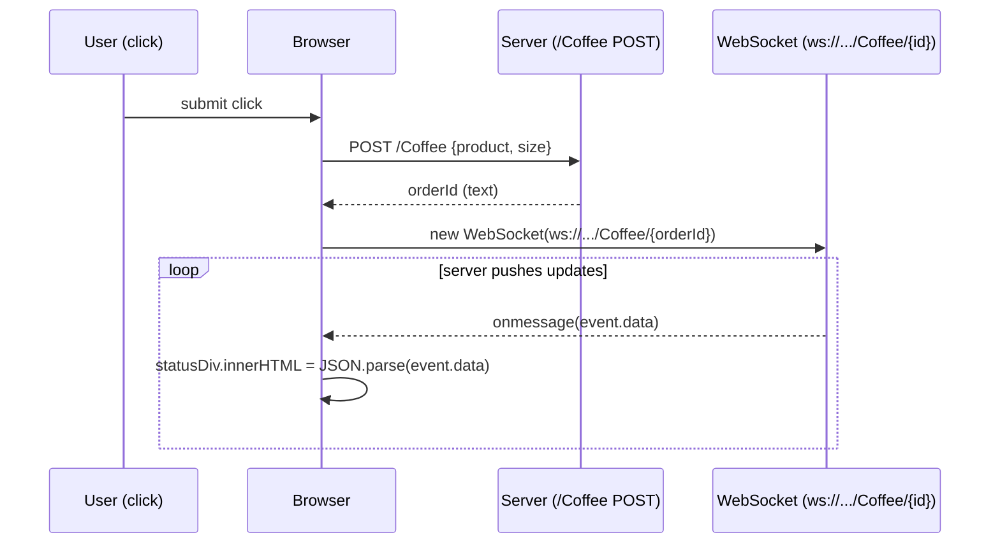

# Websockets

- Full duplex messaging
- No 6 connection limit
- Multi data-type support
- **TCP** socket upgrade: A standardized way to use one TCP socket through which messages can be sent from server to client and vice versa.
- WS protocol

## Microsoft.AspNetCore.WebSockets

- Contains a managed implementation of the WebSocket protocol, along with server integration components.
- `Microsoft.AspNetCore.WebSockets`
- `Microsoft.AspNetCore.WebSockets.Protocol`
- `Microsoft.AspNetCore.WebSockets.Server`
- `Microsoft.AspNetCore.WebSockets.Test.WebSocketMiddlewareTests` src [1]
- middleware src [2] and tests src [1]
- _Using WebSockets in ASP.NET Core_ blog [3] June, 2016
- _Websockets in Asp.Net Core_ blog [4] July 2018
- _Archived_ Implementation of the WebSocket protocol for aspnet [5], along with client and server integration components.
- asp net core api
  - configure `app.UseWebSockets(new WebSocketOptions{ KeepAliveInterval = TimeSpan.FromSeconds(120), ReceiveBufferSize = 4*1024 })`
  - controller

  ```cs
    var context = _httpContextAccessor.HttpContext;
    if (context.WebSockets.IsWebSocketRequest)
    {
        var ws = await context.WebSockets.AcceptWebSocketAsync();
        await SendEvents(ws, params object[] ...)
        await ws.CloseAsync(WebSocketCloseStatus.NormalClosure, "done", CancellationToken.None);
    }
    else
    {
        context.Response.StatusCode = 400;
    }
  ```

**`SendEvents` — server-side async loop (C#)**

```csharp
private async Task SendEvents(WebSocket webSocket, int orderNo)
{
    CheckResult result;

    do
    {
        result = _orderChecker.GetUpdate(orderNo);
        Thread.Sleep(2000);

        if (!result.New) continue;

        var jsonMessage = $"\"{result.Update}\"";
        await webSocket.SendAsync(
            buffer: new ArraySegment<byte>(
                array: Encoding.ASCII.GetBytes(jsonMessage),
                offset: 0,
                count: jsonMessage.Length),
            messageType: WebSocketMessageType.Text,
            endOfMessage: true,
            cancellationToken: CancellationToken.None);

    } while (!result.Finished);
}
```



- javascript — the client opens a WebSocket to receive updates, then POSTs via `fetch` and pipes the response into the listener:

```js
const listen = (id) => {
    const socket = new WebSocket(`ws://localhost:60907/Coffee/${id}`);

    socket.onmessage = event => {
        const statusDiv = document.getElementById("status");
        statusDiv.innerHTML = JSON.parse(event.data);
    };
};

document.getElementById("submit").addEventListener("click", e => {
    e.preventDefault();
    const product = document.getElementById("product").value;
    const size    = document.getElementById("size").value;

    fetch("/Coffee", {
        method: "POST",
        body: { product, size }
    })
    .then(response => response.text())
    .then(text => listen(text));
});
```



## Browser

- The WebSocket [6] _browser_ API.
- The WebSocket API is an advanced technology that makes it possible to open a _two-way interactive communication session_ between the user's browser and a server. With this API, you can send messages to a server and _receive event-driven responses_ **without having to poll the server for a reply**.
- Bringing Sockets to the Web [7] 2010
- desktop to web socket [8] 2012

## SignalR

[`SignalR`](signalr.md) [](signalr.md)

## Misc

- SuperWebSocket [9] A .NET server side implementation of WebSocket protocol. repo [10] _SuperWebSocket is a .NET implementation of WebSocket server_. supersocket [11] an extensible socket server framework, telnet example [12]
- C# Websockets for all platforms using native bridges NVentimiglia/Websockets.PCL [13]
- Building **Real-time** Web Apps with ASP .NET `WebAPI` and `WebSockets` blog article [14] July 17, 2012
- `Microsoft.AspNetCore.Http.WebSocketManager` src [15]
- `Microsoft.AspNetCore.TestHost.WebSocketClient` src [16]

## Radu Matei

- Simple middlware for real-time .NET Core samples [17]
- blog [18]

[<< home](../../README.md) | [< soa](../soa.md)

[1]: https://github.com/aspnet/AspNetCore/blob/7fb3d57f54bc8351e725fb936f15c5fec8dca06c/src/Middleware/WebSockets/test/UnitTests/WebSocketMiddlewareTests.cs
[2]: https://github.com/aspnet/AspNetCore/blob/7fb3d57f54bc8351e725fb936f15c5fec8dca06c/src/Middleware/WebSockets/src/WebSocketMiddleware.cs
[3]: https://dotnetthoughts.net/using-websockets-in-aspnet-core/
[4]: http://zbrad.github.io/tools/wscore/
[5]: https://github.com/aspnet/websockets
[6]: https://developer.mozilla.org/en-US/docs/Web/API/WebSockets_API
[7]: https://www.html5rocks.com/en/tutorials/websockets/basics/
[8]: https://isolasoftware.it/2012/05/04/how-to-send-live-data-from-a-c-desktop-application-to-web-using-websockets/
[9]: https://archive.codeplex.com/?p=superwebsocket
[10]: https://github.com/kerryjiang/SuperWebSocket
[11]: http://www.supersocket.net/
[12]: http://docs.supersocket.net/v2-0/en-US/A-Telnet-Example
[13]: https://github.com/NVentimiglia/Websockets.PCL
[14]: https://blogs.msdn.microsoft.com/youssefm/2012/07/17/building-real-time-web-apps-with-asp-net-webapi-and-websockets/
[15]: https://github.com/aspnet/AspNetCore/blob/425c196cba530b161b120a57af8f1dd513b96f67/src/Http/Http.Abstractions/src/WebSocketManager.cs
[16]: https://github.com/aspnet/AspNetCore/blob/1f892d798d3163b4bd9d3c4e900f6bb5c2310f9c/src/Hosting/TestHost/src/WebSocketClient.cs
[17]: https://github.com/radu-matei/websocket-manager/tree/master/samples
[18]: https://radu-matei.com/blog/aspnet-core-websockets-middleware/
