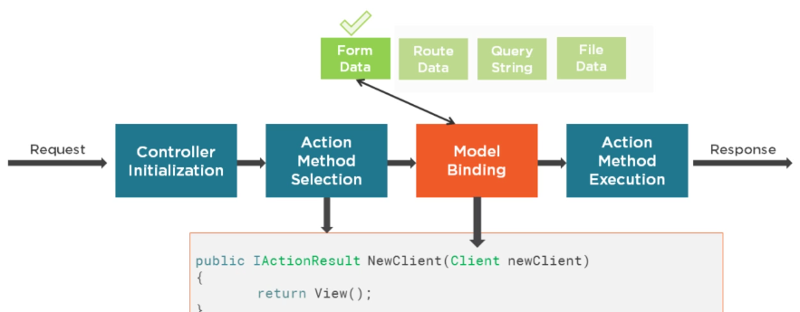
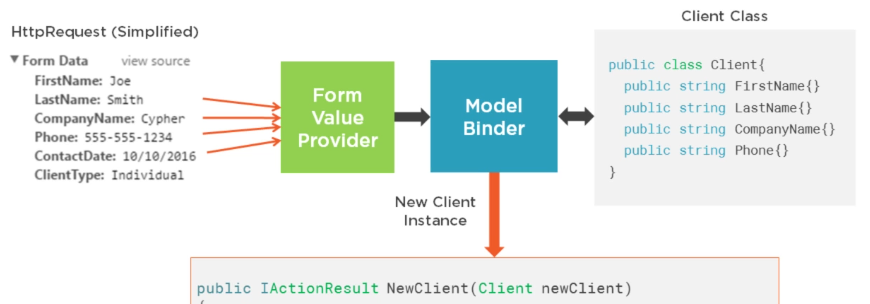

# Razor

alternative view engines: default (razor) | custom (spark, nvelocity, brail, bellevue)

## evolution

version | features
---|---
3 | engine introduced
4 | bundling, minification, mobile enhancements?
core | view components (in place of child actions), tag helpers, html helper changes

## js

angular | react | polymer | knockout | ember | meteor | vue | aurelia

`@Scripts.Render`, `@Styles.Render`pointing to resource bundles which are no longer supported.

environment tags to include resources conditionally.

```html
<environment names="development">
    <script asp-src-include="/lib/jquery/dist/**/*.js" asp-src-exclude="**.min.js"></script>
</environment>
<environment names="staging, production">
    <script asp-src-include="/lib/jquery/dist/**/*.min.js"></script>
</environment>
```

## structure

Views/Shared not specific to single controller
_ViewImports.cshtml namespaces for view files and tag helpers
_ViewStart.cshtml default layout for the razor view engine

## key value

`ViewData`: pass data from one controller to correponding view. Init to `ViewDataDictionary`. provide access to model binding data.

`TempData`: pass data from one controller to another. dictionary derived from `TempDataDictionary` class.

`ViewBag` sets and gets value dynamically. dynamic property. Available for _current requests only_, like `ViewData`. If redirection occurs its value becomes null.

## html helpers

- `@Html.ActionLink` link text, action & controller names
- strongly vs loosely typed html form helpers: `@Html`[`TextBox`|`CheckBox`|`RadioButton`|`DropDownList`|`TextArea`][|`For`]
- `@using (Html.BeginForm(method, controller, FormMethod.Post))`
- display name [attribute localization](http://adamyan.blogspot.com/2010/02/aspnet-mvc-2-localization-complete.html), annotations with [resource](https://stackoverflow.com/questions/30704121/use-resources-in-a-razor-labelfor-element)
- `@Html.ValidationMessageFor` with a model property lambda and optionally a custom error message
- `@Html.ValidationSummary()` renders model and optionally property level errors, see `excludePropertyErrors`
- @Html.HiddenFor for `input type="hidden"`

## sections

```cshtml
    @RenderBody()
    @if (IsSectionDefined("Footer"))
    {
        @RenderSection("Footer")
    }

    @section Footer { }
```

## model binding





## client validation

- `data-val-required` and `data-val-email`. Either use them directly in the razor markup
- or decorate your view model classes with validation attributes like `[Required]`, `[EmailAddress]`, `[MaxLength]`, `[RegularExpression(@"^[A-Z]+[a-zA-Z0-9""'\s-]*$")]` for a rating regex, `[StringLength(60, MinimumLength = 3)]`, `[DataType(DataType.Currency)]`, `Range`. In the markup use html helpers only.
- explicit date format `[DisplayFormat(DataFormatString = "{0:yyyy-MM-dd}", ApplyFormatInEditMode = true)]`
- friendly display name `[Display(Name = "Last Name")]`
- `[DataType(DataType.Date)] string Date {get;}`
- jQuery validation and the browser validation can both operate on the form, which is just confusing to the user. To avoid this problem, you can add the `novalidate` attribute to the `form` element.
- The MVC client-validation features are built on top of the jQuery Validation library. If you prefer, you can use the Validation library directly and ignore the MVC features.
- The term **unobtrusive** means that validation rules are expressed using _attributes added to the HTML elements_ that views generate.
- Client-side validation is focused on _validating individual properties_. In fact, it is hard to set up model level client-side validation using the built-in support that comes with MVC. To that end, most MVC applications use **client-side validation for property-level issues** and rely on _server-side validation for the overall model_
- razor markup `<input asp-for="ClientName" class="form-control" />`. tag helper transform input elements, inspects attributes on cs model classes, and add html attributes like `<input class="form-control" type="text"  data-val="true" data-val-required="The name field is required."  id="ClientName" name="ClientName" value="" />`.
- The JavaScript code looks for elements with the `data-val` attribute and performs local validation in the browser when the user submits the form, _without sending an HTTP request to the server_. submitting the form results in validation error messages displayed even though no HTTP request is sent to the server.
- if you want to use client-side validation, you need to stick to the built-in attributes

## server validation

- either remove javascript jquery import
- or perform _remote validation_ on the server through a ajax request. illusion of client side validation. use `[Remote(actionName, controllerName)]` on the view model. method should return `Json()`. Remote validation won't work without js includes, especially _unobtrusive_.
- remote validation is _performed in the background_ and unlike server-side validation only a subset of properties are validated.
- `ModelState.GetValidationState(property)` validation errors for specific property
- The tag helper adds elements _whose values have failed validation_ to the `input-validation-error` class, which can then be styled to highlight the problem to the user
- The model binder has a set of _predefined messages_ that it uses for validation errors. These can be replaced with custom messages by assigning functions to the properties defined by the  `IModelBindingMessageProvider` interface. `services.AddMvc().AddMvcOptions(opts => opts.ModelBindingMessageProvider.ValueMustNotBeNullAccessor = value => "Please enter a value");`.
- The `asp-validation-summary` attribute is applied to a div element, and it _displays_ a list of _validation errors_ when the view is rendered. The value is from an enumeration called `ValidationSummary`. `<div asp-validation-summary="ModelOnly" class="text-danger"></div>`.
- `public class CustomPropertyValidationAttribute : Attribute, IModelValidator`

## partial views

no associated actoin model. data sent by parent view.

```html
<div id = "widgets">
  <div class = "widget-container">
    @Html.Partial ("FeedbackWidget")
  </div>
  <div class = "widget-container">
    @Html.Partial ("TagCloud", tagModel)
  </div>
</div>
```

## view components

- inherit from `ViewComponent` base class
- `ViewComponent` class suffix
- use an attribute on the class
- `@await Component.InvokeAsync("XVC")`
- not a direct replacement for child actions, not backed by amy action method
- child action: `Views/Shared/{ViewName}`
- view component: `Views/Shared/Components/{ComponentName}/{ViewName}`. Component name is class name, view name is `Default.cshtml`.
- e.g. param overload `async Task<IViewComponentResult> InvokeAsync(int threshold=10)`

## tag helpers

- lightweight attribute syntax that looks like html
- input asp-for, link asp-href-include, span asp-validation-for, form asp-controller asp-action
- div asp-validation-summary="ModelOnly" needs property level validation for each filed
- the way forward compared to html helpers
- custom tag helper can be an attribute or html element
- inherit from `TagHelper`
- implement `Process (TagHelperContext context, TagHelperOutput output)`

## theming

- `ThemeExpander : IViewLocationExpander`

```cs
services.Configure<razorViewEngineOptions>(opts => {
  opts.ViewLocationExpanders.Clear();
  opts.ViewLocationExpanders.Add(new ThemeExpander());
});
```

- instead of `Views` folder, use `Themes` with `Default` and `Alternate` subfolders.
- `RazorPage<TModel>`
- custom editor/view templates `Shared\EditorTemplates\Date.cshtml`

[<<](../ASP.md) | [mvc](./mvc.md) | [home](../../README.md)