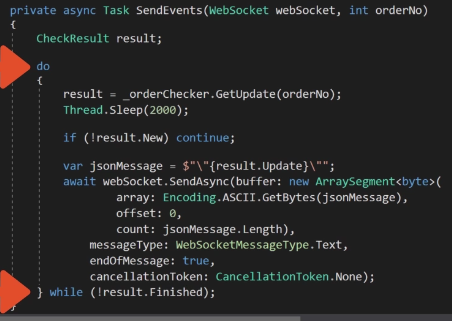
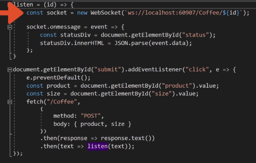

# Websockets

- Full duplex messaging
- No 6 connection limit
- Multi data-type support
- TCP socket upgrade: A standardized way to use one TCP socket through which messages can be sent from server to client and vice versa.
- WS protocol

## Microsoft.AspNetCore.WebSockets

- Contains a managed implementation of the WebSocket protocol, along with server integration components.
- `Microsoft.AspNetCore.WebSockets`
- `Microsoft.AspNetCore.WebSockets.Protocol`
- `Microsoft.AspNetCore.WebSockets.Server`
- `Microsoft.AspNetCore.WebSockets.Test.WebSocketMiddlewareTests` [src](https://github.com/aspnet/AspNetCore/blob/7fb3d57f54bc8351e725fb936f15c5fec8dca06c/src/Middleware/WebSockets/test/UnitTests/WebSocketMiddlewareTests.cs)
- middleware [src](https://github.com/aspnet/AspNetCore/blob/7fb3d57f54bc8351e725fb936f15c5fec8dca06c/src/Middleware/WebSockets/src/WebSocketMiddleware.cs) and tests [src](https://github.com/aspnet/AspNetCore/blob/7fb3d57f54bc8351e725fb936f15c5fec8dca06c/src/Middleware/WebSockets/test/UnitTests/WebSocketMiddlewareTests.cs)
- _Using WebSockets in ASP.NET Core_ [blog](https://dotnetthoughts.net/using-websockets-in-aspnet-core/) June, 2016
- _Websockets in Asp.Net Core_ [blog](http://zbrad.github.io/tools/wscore/) July 2018
- _Archived_ Implementation of the [WebSocket protocol for aspnet](https://github.com/aspnet/websockets), along with client and server integration components.
- asp net core api
  - configure `app.UseWebSockets(new WebSocketOptions{ KeepAliveInterval = TimeSpan.FromSeconds(120), ReceiveBufferSize = 4*1024 })`
  - controller

  ```cs
    var context = _httpContextAccessor.HttpContext;
    if (context.WebSockets.IsWebSocketRequest)
    {
        var ws = await context.WebSockets.AcceptWebSocketAsync();
        await SendEvents(ws, params object[] ...)
        await ws.CloseAsync(WebSocketCloseStatus.NormalClosure, "done", CancellationToken.None);
    }
    else
    {
        context.Response.StatusCode = 400;
    }
  ```



- javascript 

## browser

- The [WebSocket](https://developer.mozilla.org/en-US/docs/Web/API/WebSockets_API) _browser_ API.
- The WebSocket API is an advanced technology that makes it possible to open a _two-way interactive communication session_ between the user's browser and a server. With this API, you can send messages to a server and _receive event-driven responses_ **without having to poll the server for a reply**.
- [Bringing Sockets to the Web](https://www.html5rocks.com/en/tutorials/websockets/basics/) 2010
- [desktop to web socket](https://isolasoftware.it/2012/05/04/how-to-send-live-data-from-a-c-desktop-application-to-web-using-websockets/) 2012

## SignalR

[SignalR](signalr.md) [](signalr.md)

## misc

- [SuperWebSocket](https://archive.codeplex.com/?p=superwebsocket) A .NET server side implementation of WebSocket protocol. [repo](https://github.com/kerryjiang/SuperWebSocket) _SuperWebSocket is a .NET implementation of WebSocket server_. [supersocket](http://www.supersocket.net/) an extensible socket server framework, [telnet example](http://docs.supersocket.net/v2-0/en-US/A-Telnet-Example)
- C# Websockets for all platforms using native bridges [NVentimiglia/Websockets.PCL](https://github.com/NVentimiglia/Websockets.PCL)
- Building **Real-time** Web Apps with ASP .NET `WebAPI` and `WebSockets` [blog article](https://blogs.msdn.microsoft.com/youssefm/2012/07/17/building-real-time-web-apps-with-asp-net-webapi-and-websockets/) July 17, 2012
- `Microsoft.AspNetCore.Http.WebSocketManager` [src](https://github.com/aspnet/AspNetCore/blob/425c196cba530b161b120a57af8f1dd513b96f67/src/Http/Http.Abstractions/src/WebSocketManager.cs)
- `Microsoft.AspNetCore.TestHost.WebSocketClient` [src](https://github.com/aspnet/AspNetCore/blob/1f892d798d3163b4bd9d3c4e900f6bb5c2310f9c/src/Hosting/TestHost/src/WebSocketClient.cs)

## radu matei

- Simple middlware for real-time .NET Core [samples](https://github.com/radu-matei/websocket-manager/tree/master/samples)
- [blog](https://radu-matei.com/blog/aspnet-core-websockets-middleware/)

[<< home](../../README.md) | [< soa](../soa.md)