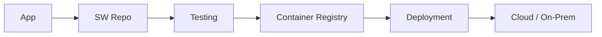

# Repository Reorganization Implementation Plan

> **For agentic workers:** REQUIRED SUB-SKILL: Use superpowers:subagent-driven-development (recommended) or superpowers:executing-plans to implement this plan task-by-task. Steps use checkbox (`- [ ]`) syntax for tracking.

**Goal:** Reorganize 200+ scattered documentation files into a clean 4-level hierarchy with consistent formatting, markdownlint compliance, and semantic entity formatting.

**Architecture:** Phase-based migration — infrastructure first, then file moves per category, then content consolidation (Azure flattening, merges), then binary extraction (PNGs/PDFs to markdown/Mermaid/ASCII), then formatting passes, then navigation/indexes, then root files, then validation and cleanup.

**Tech Stack:** Jekyll (just-the-docs theme), GitHub Pages, markdownlint, Mermaid diagrams, Git

**Spec:** `docs/superpowers/specs/2026-03-29-repo-reorganization-design.md`

---

## Phase 1: Infrastructure

### Task 1: Create Markdownlint Config and Target Directory Structure

**Files:**
- Create: `.markdownlint.json`
- Create: All target directories (empty)

- [ ] **Step 1: Create `.markdownlint.json`**

```json
{
  "default": true,
  "MD013": false,
  "MD033": false,
  "MD024": { "siblings_only": true },
  "MD034": true,
  "MD041": true,
  "MD025": true
}
```

- [ ] **Step 2: Create all target directories**

```bash
mkdir -p dotnet/language dotnet/runtime dotnet/aspnet dotnet/data-access dotnet/parallelism
mkdir -p javascript/angular
mkdir -p architecture
mkdir -p distributed-systems
mkdir -p data/sql/scripts data/nosql/mongo
mkdir -p web-services
mkdir -p azure/lectures
mkdir -p testing
mkdir -p devops/os
```

- [ ] **Step 3: Verify structure**

```bash
find dotnet javascript architecture distributed-systems data web-services azure testing devops -type d | sort
```

Expected: All 20 directories listed.

- [ ] **Step 4: Commit**

```bash
git add .markdownlint.json dotnet/ javascript/ architecture/ distributed-systems/ data/ web-services/ azure/ testing/ devops/
git commit -m "chore: add markdownlint config and target directory structure"
```

---

## Phase 2: File Migration

Each task moves files from old locations to new, renaming to kebab-case. No content changes yet — just structural moves. Tasks 2-10 can be run in parallel.

### Task 2: Migrate dotnet/language Files

**Files:**
- Move: `doc/c#/*.md` (excluding `automapper.md`) -> `dotnet/language/`

- [ ] **Step 1: Move and rename C# language files**

Source -> Destination mapping:

```bash
cp "doc/c#/AnonymousTypes.md" dotnet/language/anonymous-types.md
cp "doc/c#/CoContraVariance.md" dotnet/language/co-contra-variance.md
cp "doc/c#/CollectionsPerformance.md" dotnet/language/collections-performance.md
cp "doc/c#/Delegates.md" dotnet/language/delegates.md
cp "doc/c#/Events.md" dotnet/language/events.md
cp "doc/c#/Exceptions.md" dotnet/language/exceptions.md
cp "doc/c#/Immutable.md" dotnet/language/immutable-types.md
cp "doc/c#/Interfaces.md" dotnet/language/interfaces.md
cp "doc/c#/Lambdas.md" dotnet/language/lambdas.md
cp "doc/c#/ManagedCppCLI.md" dotnet/language/managed-cpp-cli.md
cp "doc/c#/rx.md" dotnet/language/rx.md
```

- [ ] **Step 2: Verify all 11 files landed**

```bash
ls dotnet/language/*.md | wc -l
```

Expected: `11`

- [ ] **Step 3: Commit**

```bash
git add dotnet/language/
git commit -m "chore: migrate C# language files to dotnet/language"
```

### Task 3: Migrate dotnet/runtime Files

**Files:**
- Move: `doc/c#/CLR.md`, `doc/c#/GarbageCollection.md`, `doc/c#/Finalize.md`, `doc/c#/Assemblies.md`, `doc/c#/ApplicationDomains.md` -> `dotnet/runtime/`

- [ ] **Step 1: Move and rename runtime files**

```bash
cp "doc/c#/CLR.md" dotnet/runtime/clr.md
cp "doc/c#/GarbageCollection.md" dotnet/runtime/garbage-collection.md
cp "doc/c#/Finalize.md" dotnet/runtime/finalize.md
cp "doc/c#/Assemblies.md" dotnet/runtime/assemblies.md
cp "doc/c#/ApplicationDomains.md" dotnet/runtime/app-domains.md
```

- [ ] **Step 2: Verify all 5 files landed**

```bash
ls dotnet/runtime/*.md | wc -l
```

Expected: `5`

- [ ] **Step 3: Commit**

```bash
git add dotnet/runtime/
git commit -m "chore: migrate CLR/runtime files to dotnet/runtime"
```

### Task 4: Migrate dotnet/aspnet Files (Merge ASP.NET + ASP.NET Core)

**Files:**
- Move: `doc/asp/*.md` -> `dotnet/aspnet/`
- Move: `doc/netcore/*.md` -> `dotnet/aspnet/`
- Note: `doc/ASP.md` and `doc/netcore.md` index content will be merged into `dotnet/aspnet/index.md` in Task 19

- [ ] **Step 1: Move ASP.NET legacy files**

```bash
cp doc/asp/mvc.md dotnet/aspnet/mvc.md
cp doc/asp/OpenIDConnect.md dotnet/aspnet/openid-connect.md
cp doc/asp/razor.md dotnet/aspnet/razor.md
```

- [ ] **Step 2: Move ASP.NET Core files**

```bash
cp doc/netcore/attrib.md dotnet/aspnet/attributes.md
cp doc/netcore/authorization.md dotnet/aspnet/authorization.md
cp doc/netcore/blazor.md dotnet/aspnet/blazor.md
cp "doc/netcore/Building.A.Web.App.With.ASP.NET.Core.MVC6.EFCore.And.Angular.md" dotnet/aspnet/web-app-mvc6-efcore-angular.md
cp doc/netcore/commands.md dotnet/aspnet/commands.md
cp doc/netcore/middleware.md dotnet/aspnet/middleware.md
```

- [ ] **Step 3: Verify all 9 files landed**

```bash
ls dotnet/aspnet/*.md | wc -l
```

Expected: `9`

- [ ] **Step 4: Commit**

```bash
git add dotnet/aspnet/
git commit -m "chore: migrate and merge ASP.NET + ASP.NET Core into dotnet/aspnet"
```

### Task 5: Migrate dotnet/data-access and dotnet/parallelism

**Files:**
- Move: `doc/orm/*.md` + `doc/c#/automapper.md` -> `dotnet/data-access/`
- Move: `doc/parallel/*.md` -> `dotnet/parallelism/`

- [ ] **Step 1: Move ORM/data-access files**

```bash
cp doc/orm/ef.md dotnet/data-access/entity-framework.md
cp doc/orm/efcore.md dotnet/data-access/ef-core.md
cp "doc/c#/automapper.md" dotnet/data-access/automapper.md
```

- [ ] **Step 2: Move parallelism files**

```bash
cp doc/parallel/dotnetManagedThreads.md dotnet/parallelism/managed-threads.md
cp doc/parallel/dotnetThreadsBackForeGround.md dotnet/parallelism/background-foreground-threads.md
cp doc/parallel/dotnetThreadsProcesses.md dotnet/parallelism/threads-vs-processes.md
cp doc/parallel/dotnetThreadsTasks.md dotnet/parallelism/threads-vs-tasks.md
cp doc/parallel/dotnetUIThreads.md dotnet/parallelism/ui-threads.md
cp doc/parallel/threadPool.md dotnet/parallelism/thread-pool.md
cp doc/parallel/threadLocalStorage.md dotnet/parallelism/thread-local-storage.md
cp doc/parallel/tplCollections.md dotnet/parallelism/tpl-collections.md
```

Note: `tpl-dataflow.md` will be created from PDF extraction in Task 13. `TPLDataflow.pdf` is not moved here.

- [ ] **Step 3: Verify file counts**

```bash
ls dotnet/data-access/*.md | wc -l  # Expected: 3
ls dotnet/parallelism/*.md | wc -l  # Expected: 8
```

- [ ] **Step 4: Commit**

```bash
git add dotnet/data-access/ dotnet/parallelism/
git commit -m "chore: migrate ORM and parallelism files to dotnet/"
```

### Task 6: Migrate javascript Files (Absorb CSS)

**Files:**
- Move: `doc/js/*.md` -> `javascript/` and `javascript/angular/`
- Move: `doc/CSS.md` -> `javascript/css.md`

- [ ] **Step 1: Move JS root-level files**

```bash
cp doc/js/npm.md javascript/npm.md
cp doc/js/pwa.md javascript/pwa.md
cp doc/js/webpack.md javascript/webpack.md
cp doc/js/redux.md javascript/redux.md
```

- [ ] **Step 2: Move Angular files**

```bash
cp doc/js/AngularFundamentals.md javascript/angular/fundamentals.md
cp doc/js/AngularJS.md javascript/angular/angularjs.md
cp doc/js/ng2.md javascript/angular/angular2.md
cp doc/js/ng4.md javascript/angular/angular4.md
```

- [ ] **Step 3: Absorb CSS**

```bash
cp doc/CSS.md javascript/css.md
```

- [ ] **Step 4: Verify file counts**

```bash
ls javascript/*.md | wc -l           # Expected: 5
ls javascript/angular/*.md | wc -l   # Expected: 4
```

- [ ] **Step 5: Commit**

```bash
git add javascript/
git commit -m "chore: migrate JavaScript files and absorb CSS into javascript/"
```

### Task 7: Migrate architecture Files

**Files:**
- Move: `doc/oop/*.md` -> `architecture/`

- [ ] **Step 1: Move and rename**

```bash
cp doc/oop/principles.md architecture/principles.md
cp doc/oop/solid.md architecture/solid.md
cp doc/oop/DDD.md architecture/ddd.md
cp doc/oop/domain-strength.md architecture/domain-strength.md
cp doc/oop/dp.md architecture/design-patterns.md
cp doc/oop/uml.md architecture/uml.md
```

- [ ] **Step 2: Verify**

```bash
ls architecture/*.md | wc -l
```

Expected: `6`

- [ ] **Step 3: Commit**

```bash
git add architecture/
git commit -m "chore: migrate OOP/design files to architecture/"
```

### Task 8: Migrate distributed-systems Files (Merge Messaging + SOA)

**Files:**
- Move: `doc/soa/*.md` -> `distributed-systems/`
- Move: `doc/msg/*.md` -> `distributed-systems/`
- Note: `doc/messaging.md` and `doc/soa.md` index content merged into `distributed-systems/index.md` in Task 19

- [ ] **Step 1: Move SOA files**

```bash
cp doc/soa/Microservices-Architecture.md distributed-systems/microservices-architecture.md
cp "doc/soa/Microservices-with-.NET.md" distributed-systems/microservices-dotnet.md
cp doc/soa/Docker.md distributed-systems/docker.md
cp doc/soa/nanosvc.md distributed-systems/nanoservices.md
cp doc/soa/signalr.md distributed-systems/signalr.md
cp doc/soa/websockets.md distributed-systems/websockets.md
cp doc/soa/azure.md distributed-systems/azure-services.md
```

- [ ] **Step 2: Move messaging files**

```bash
cp doc/msg/ApacheKafka.md distributed-systems/kafka.md
cp doc/msg/ZeroMQ.md distributed-systems/zeromq.md
```

Note: `doc/msg/MPI.md` is referenced in index but does not exist — skip.

- [ ] **Step 3: Verify**

```bash
ls distributed-systems/*.md | wc -l
```

Expected: `9`

- [ ] **Step 4: Commit**

```bash
git add distributed-systems/
git commit -m "chore: merge messaging + SOA into distributed-systems/"
```

### Task 9: Migrate data Files (SQL + NoSQL)

**Files:**
- Move: `doc/sql/*.md` + `doc/sql/scripts/` -> `data/sql/`
- Move: `doc/nosql/*.md` -> `data/nosql/` and `data/nosql/mongo/`

- [ ] **Step 1: Move SQL files**

```bash
cp doc/sql/ACID.md data/sql/acid.md
cp doc/sql/indexes.md data/sql/indexes.md
cp doc/sql/ConnectionPool.md data/sql/connection-pool.md
cp doc/sql/DAOvsRepository.md data/sql/dao-vs-repository.md
cp doc/sql/DbCommand.md data/sql/db-command.md
cp doc/sql/ForeignKeyMapping.md data/sql/foreign-key-mapping.md
cp doc/sql/PrimaryKeys.md data/sql/primary-keys.md
cp doc/sql/ReferentialIntegrity.md data/sql/referential-integrity.md
cp doc/sql/ServiceBroker.md data/sql/service-broker.md
cp doc/sql/StringSearchDbStoredProc.md data/sql/string-search-stored-proc.md
cp doc/sql/TableSchema.md data/sql/table-schema.md
cp doc/sql/TemporaryTables.md data/sql/temporary-tables.md
cp doc/sql/views.md data/sql/views.md
cp doc/sql/samples.md data/sql/samples.md
cp doc/sql/MySQL.md data/sql/mysql.md
cp doc/sql/postgre.md data/sql/postgresql.md
```

- [ ] **Step 2: Move SQL scripts**

```bash
cp doc/sql/scripts/instnwnd.sql data/sql/scripts/instnwnd.sql
cp doc/sql/scripts/instpubs.sql data/sql/scripts/instpubs.sql
```

- [ ] **Step 3: Move NoSQL files**

```bash
cp doc/nosql/BASE.md data/nosql/base.md
cp doc/nosql/CAP.md data/nosql/cap.md
cp doc/nosql/cosmos.md data/nosql/cosmos.md
cp doc/nosql/DocumentDB.md data/nosql/document-db.md
cp doc/nosql/graphdb.md data/nosql/graph-db.md
cp doc/nosql/M101N.md data/nosql/m101n.md
```

- [ ] **Step 4: Move Mongo sub-files**

```bash
cp doc/nosql/MongoArticles.md data/nosql/mongo/articles.md
cp doc/nosql/MongoRecipes.md data/nosql/mongo/recipes.md
cp doc/nosql/MongoSchema.md data/nosql/mongo/schema.md
```

Note: `doc/nosql/Mongo.md` is an index — its content becomes `data/nosql/mongo/index.md` in Task 19. `document-db-cheat-sheet.md` created from PDF in Task 13.

- [ ] **Step 5: Verify file counts**

```bash
ls data/sql/*.md | wc -l             # Expected: 16
ls data/sql/scripts/*.sql | wc -l    # Expected: 2
ls data/nosql/*.md | wc -l           # Expected: 6
ls data/nosql/mongo/*.md | wc -l     # Expected: 3
```

- [ ] **Step 6: Commit**

```bash
git add data/
git commit -m "chore: migrate SQL and NoSQL files to data/"
```

### Task 10: Migrate web-services Files

**Files:**
- Move: `doc/rest/*.md` -> `web-services/`

- [ ] **Step 1: Move and rename**

```bash
cp doc/rest/http.md web-services/http.md
cp doc/rest/hateoas.md web-services/hateoas.md
cp doc/rest/GraphQL.md web-services/graphql.md
cp doc/rest/swagger.md web-services/swagger.md
cp doc/rest/autorest.md web-services/autorest.md
cp doc/rest/cache.md web-services/caching.md
cp doc/rest/etag.md web-services/etag.md
cp doc/rest/httpclient.md web-services/httpclient.md
cp doc/rest/call.md web-services/calling-rest-apis.md
cp doc/rest/webapi.md web-services/webapi.md
cp doc/rest/webapi-asp-net-course.md web-services/webapi-course.md
cp doc/rest/webApiUpDownLoad.md web-services/webapi-upload-download.md
cp doc/rest/webApiVersion.md web-services/webapi-versioning.md
```

- [ ] **Step 2: Verify**

```bash
ls web-services/*.md | wc -l
```

Expected: `13`

- [ ] **Step 3: Commit**

```bash
git add web-services/
git commit -m "chore: migrate REST/API files to web-services/"
```

### Task 11: Migrate testing and devops Files (Absorb OS)

**Files:**
- Move: `doc/tdd/*.md` -> `testing/`
- Move: `doc/tools/*.md` (excluding `mra.md`) -> `devops/`
- Move: `doc/os/virtual-memory.md` -> `devops/os/`

- [ ] **Step 1: Move testing files**

```bash
cp doc/tdd/nunit.md testing/nunit.md
cp doc/tdd/xunit.md testing/xunit.md
```

- [ ] **Step 2: Move devops files**

```bash
cp doc/tools/git.md devops/git.md
cp doc/tools/GithubDocs.md devops/github-docs.md
cp doc/tools/CD.md devops/ci-cd.md
cp doc/tools/NuGet.md devops/nuget.md
cp doc/tools/vs.md devops/visual-studio.md
cp doc/tools/yaml.md devops/yaml.md
cp doc/tools/GAPI.md devops/google-api.md
cp doc/tools/mobile.md devops/mobile.md
cp doc/tools/jtr.md devops/john-the-ripper.md
cp doc/tools/acronyms.md devops/acronyms.md
```

Note: `doc/tools/mra.md` (Movie Review Aggregator) is dropped — not dev documentation.

- [ ] **Step 3: Absorb OS**

```bash
cp doc/os/virtual-memory.md devops/os/virtual-memory.md
```

- [ ] **Step 4: Verify file counts**

```bash
ls testing/*.md | wc -l       # Expected: 2
ls devops/*.md | wc -l        # Expected: 10
ls devops/os/*.md | wc -l     # Expected: 1
```

- [ ] **Step 5: Commit**

```bash
git add testing/ devops/
git commit -m "chore: migrate testing and devops files, absorb OS"
```

---

## Phase 3: Content Consolidation

### Task 12: Flatten Azure Learning Modules

**Files:**
- Read: All 67 files in `azure/learn/`
- Read: `azure/az.md`, `azure/learn.md`, `azure/lectures.md`, `azure/resources.md`, `azure/legend.md`
- Read: `azure/pages/app.insight.md`, `azure/pages/osi.md`
- Create: `azure/index.md`, `azure/cloud-concepts.md`, `azure/core-services.md`, `azure/solutions-and-tools.md`, `azure/security.md`, `azure/identity-and-governance.md`, `azure/cost-management.md`, `azure/az-900-summary.md`, `azure/legend.md`, `azure/resources.md`, `azure/app-insights.md`, `azure/osi.md`
- Create: `azure/lectures/hybrid-infrastructure.md`, `azure/lectures/modernize-dotnet.md`

This is the largest content task. The agent must read every source file and consolidate.

**Azure consolidation merge strategy:**
1. Read every source file for a learning path using the Read tool
2. Group content by topic (not by source file) — if two modules both discuss "compute services", merge into one section
3. Discard navigation boilerplate (breadcrumbs, "next module" links, "prerequisites" sections)
4. Preserve all substantive content: definitions, explanations, examples, tables, lists, diagrams
5. Consolidate knowledge check questions into a single `## Knowledge Check` section at the bottom — keep all questions, remove duplicate questions that appear in multiple files
6. Apply all formatting conventions inline during consolidation (reference-style links, semantic entity formatting, heading title case, no bare URLs, no emoji)
7. If two source files contradict each other, prefer the more detailed version

- [ ] **Step 1: Read all LP1 source files and create `azure/cloud-concepts.md`**

Read each of these source files using the Read tool:
- `azure/learn/1-lp-az-900.md` (landing page intro)
- `azure/learn/114-tour.md` (tour of Azure services)
- `azure/learn/115-account.md` (Azure accounts)
- `azure/learn/117-kc.md` (knowledge check)
- `azure/learn/tocm.md` (cloud models)
- `azure/learn/service-models.md` (IaaS/PaaS/SaaS)
- `azure/learn/125A-kc.md`, `azure/learn/125B-kc.md` (knowledge checks)
- `azure/learn/133-region.md` (regions, availability zones)
- `azure/learn/136-kc.md` (knowledge check)

Write `azure/cloud-concepts.md` with this structure — H2 sections in this order, each containing the merged content from the files listed:

```markdown
# Cloud Concepts

## Tour of Azure Services

[merged content from 114-tour.md: compute, networking, storage, database, AI/ML, DevTools]

## Azure Accounts and Subscriptions

[merged content from 115-account.md]

## Cloud Models

[merged content from tocm.md: public, private, hybrid cloud]

## Service Models

[merged content from service-models.md: **IaaS**, **PaaS**, **SaaS** definitions and comparisons]

## Regions and Availability Zones

[merged content from 133-region.md: region pairs, availability zones, geography]

## Knowledge Check

[all unique questions from 117-kc.md, 125A-kc.md, 125B-kc.md, 136-kc.md — numbered list, Q&A format]

[<<](./index.md) | [home](../README.md)

[1]: https://...
```

- [ ] **Step 2: Read all LP2 source files and create `azure/core-services.md`**

Read: `azure/learn/2-lp-az-900.md`, `azure/learn/218-kc.md`, `azure/learn/227-kc.md`, `azure/learn/237-kc.md`, `azure/learn/249-kc.md`

Write `azure/core-services.md` with H2 sections: Compute Services, Networking Services, Storage Services, Database Services, Knowledge Check. Merge substantive content from each file into the matching topic section. Knowledge checks from all `-kc.md` files consolidated at bottom.

- [ ] **Step 3: Read all LP3 source files and create `azure/solutions-and-tools.md`**

Read: `azure/learn/3-lp-az-900.md`, `azure/learn/317-kc.md`, `azure/learn/327-kc.md`, `azure/learn/336-kc.md`, `azure/learn/347-kc.md`, `azure/learn/359-kc.md`

Write `azure/solutions-and-tools.md` with H2 sections: IoT Solutions, AI and Machine Learning, Serverless Computing, DevTools, Monitoring, Knowledge Check.

- [ ] **Step 4: Read all LP4 source files and create `azure/security.md`**

Read: `azure/learn/4-lp-az-900.md`, `azure/learn/akv.pass.md`, and all files matching `azure/learn/4*-*.md` (use Glob to find them).

Write `azure/security.md` with H2 sections: Azure Firewall, DDoS Protection, Network Security Groups, Key Vault, Defense in Depth, Knowledge Check.

- [ ] **Step 5: Read all LP5 source files and create `azure/identity-and-governance.md`**

Read: `azure/learn/5-lp-az-900.md`, and all files matching `azure/learn/5*-*.md` (use Glob to find them).

Also read `azure/learn/524-payasyougo.png` using the Read tool (it renders images) and extract text inline. Read `azure/learn/adfs-aad-spo-federated-sso.png` and convert the SSO federation flow to a Mermaid sequence diagram.

Write `azure/identity-and-governance.md` with H2 sections: Azure Active Directory, MFA and Conditional Access, RBAC, Resource Locks, Tags, Azure Policy, Compliance and Privacy, Knowledge Check.

- [ ] **Step 6: Read all LP6 source files and create `azure/cost-management.md`**

Read: `azure/learn/6-lp-az-900.md`, `azure/learn/617-kc.md`, `azure/learn/626-kc.md`

Write `azure/cost-management.md` with H2 sections: Pricing Models, TCO Calculator, Cost Optimization, Knowledge Check.

- [ ] **Step 7: Merge `azure/learn/az900.md` and `azure/learn/az900-kc.md` into `azure/az-900-summary.md`**

Read both files. Write `azure/az-900-summary.md` combining the summary content first, then all knowledge check questions in a `## Knowledge Check` section.

- [ ] **Step 8: Move standalone Azure files**

```bash
cp azure/pages/app.insight.md azure/app-insights.md
cp azure/pages/osi.md azure/osi.md
```

Note: `azure/legend.md` and `azure/resources.md` are already at the correct target path — no move needed. Only apply formatting conventions to them in Phase 5.

- [ ] **Step 9: Create Azure lecture files**

Read `azure/lctrs/hybrid.infra.md` using the Read tool. Then read each PNG in `azure/lctrs/pics/l02/` using the Read tool (it renders images). For each PNG, apply the conversion rules from the "PNG Conversion Decision Rules" section below.

Write `azure/lectures/hybrid-infrastructure.md` with the original markdown content plus the extracted PNG content inserted at relevant locations.

Read `azure/lctrs/mdrnz.net.md`. Read `azure/lctrs/pics/l01/migration.journey.png` and `azure/lctrs/pics/l01/web.app.hosting.png`. Convert `migration.journey.png` to ASCII art table. Convert `web.app.hosting.png` using PNG conversion rules.

Write `azure/lectures/modernize-dotnet.md`.
- Extract text from `azure/lctrs/pics/l01/web.app.hosting.png` into content (Mermaid or ASCII)

Apply all formatting conventions to both files.

- [ ] **Step 10: Verify Azure file count**

```bash
ls azure/*.md | wc -l              # Expected: 12
ls azure/lectures/*.md | wc -l    # Expected: 2
```

- [ ] **Step 11: Commit**

```bash
git add azure/
git commit -m "feat: flatten Azure learning modules into topic-based files"
```

---

## PNG Conversion Decision Rules

Used by Tasks 12, 14, and 15 whenever converting a PNG to text/Mermaid/ASCII:

1. **Read the PNG** using the Read tool (it renders images natively)
2. **Classify the content:**
   - **Text-only** (slide screenshot with just bullet points, no arrows/boxes): Extract as plain markdown text
   - **Flow/sequence** (boxes connected by arrows showing a process): Convert to Mermaid `flowchart` or `sequenceDiagram`
   - **Network/architecture** (boxes showing system components with connections): Convert to Mermaid `flowchart`
   - **Table/grid** (rows and columns of data): Convert to markdown table or ASCII art table
   - **Logo collage** (company logos with no structural data): Convert to inline comma-separated list
3. **Confidence check:** If the Mermaid conversion would lose significant spatial/structural information, fall back to ASCII art. If ASCII art would also be unclear, keep the image and add alt text instead.
4. **Validation:** After writing the Mermaid block, mentally trace the diagram — do the connections match what the image showed?

## Bare URL Labeling Strategy

Used by Task 16 whenever converting a bare URL to a labeled reference link:

1. **GitHub URLs** (`github.com/owner/repo/...`): Use `owner/repo` + file name if present. Example: `https://github.com/HangfireIO/Hangfire/blob/.../ServerProcessExtensions.cs#L57` -> `HangfireIO/Hangfire ServerProcessExtensions.cs`
2. **Microsoft Docs** (`docs.microsoft.com/...` or `learn.microsoft.com/...`): Use the last path segment humanized. Example: `https://docs.microsoft.com/en-us/dotnet/standard/parallel-programming/` -> `Microsoft Docs: Parallel Programming`
3. **Course/tutorial sites** (Pluralsight, Channel9, Udemy): Use course/video title from the URL slug. Example: `https://app.pluralsight.com/library/courses/docker-deep-dive-update/` -> `Pluralsight: Docker Deep Dive`
4. **Other URLs**: Use the domain + last meaningful path segment. Example: `https://nordicapis.com/5-protocols-for-event-driven-api-architectures/` -> `Nordic APIs: 5 Protocols for Event-Driven API Architectures`
5. **If the surrounding markdown already has descriptive text** (e.g., a list item says "CQRS article" followed by a bare URL), use that text as the label.

---

## Phase 4: Binary Content Extraction

Tasks 13-15 can be run in parallel.

### Task 13: Extract PDFs to Markdown

**Files:**
- Read: `doc/parallel/TPLDataflow.pdf`
- Read: `doc/nosql/microsoft-documentdb-sql-query-cheat-sheet-v4.pdf`
- Create: `dotnet/parallelism/tpl-dataflow.md`
- Create: `data/nosql/document-db-cheat-sheet.md`

- [ ] **Step 1: Read `TPLDataflow.pdf` and create `dotnet/parallelism/tpl-dataflow.md`**

Use the Read tool with `file_path: "D:/GIT/Tutorial/doc/parallel/TPLDataflow.pdf"` — the Read tool can parse PDFs directly. For large PDFs, use the `pages` parameter (e.g., `pages: "1-10"`, then `pages: "11-20"`).

From the extracted content, write `dotnet/parallelism/tpl-dataflow.md`:
- H1 title: `# TPL Dataflow`
- Organize content under H2 sections matching the PDF's structure (typically: Introduction, Dataflow Blocks, Linking Blocks, Execution, Examples)
- Put code samples in `csharp` fenced code blocks
- Apply semantic entity formatting: **dataflow** (pattern), `TPL` (framework), _Task Parallel Library_ (methodology)
- Add reference-style link at bottom: `[1]: https://docs.microsoft.com/en-us/dotnet/standard/parallel-programming/dataflow-task-parallel-library`
- Bottom nav: `[<<](./index.md) | [home](../../README.md)`

- [ ] **Step 2: Read DocumentDB cheat sheet PDF and create `data/nosql/document-db-cheat-sheet.md`**

Use the Read tool with `file_path: "D:/GIT/Tutorial/doc/nosql/microsoft-documentdb-sql-query-cheat-sheet-v4.pdf"`.

Write `data/nosql/document-db-cheat-sheet.md`:
- H1 title: `# DocumentDB SQL Query Cheat Sheet`
- Organize by query type (SELECT, FROM, WHERE, JOIN, operators, built-in functions, etc.)
- Put all SQL syntax examples in `sql` fenced code blocks
- Add reference-style link at bottom: `[1]: https://docs.microsoft.com/en-us/azure/cosmos-db/sql-query-getting-started`
- Bottom nav: `[<<](./index.md) | [home](../../README.md)`

- [ ] **Step 3: Verify**

```bash
test -f dotnet/parallelism/tpl-dataflow.md && echo "OK" || echo "MISSING"
test -f data/nosql/document-db-cheat-sheet.md && echo "OK" || echo "MISSING"
```

- [ ] **Step 4: Commit**

```bash
git add dotnet/parallelism/tpl-dataflow.md data/nosql/document-db-cheat-sheet.md
git commit -m "feat: extract PDF content to markdown (TPL Dataflow + DocumentDB cheat sheet)"
```

### Task 14: Extract Docker PNGs and Enrich docker.md

**Files:**
- Read: All 9 `todo/*.PNG` files
- Modify: `distributed-systems/docker.md`

The existing `docker.md` (copied from `doc/soa/Docker.md` in Task 8) already has substantial content. Append new sections extracted from PNGs.

- [ ] **Step 1: Read all 9 Docker PNGs and prepare content**

For each PNG, extract content using the strategy from the spec:

**`automated-workflow-docker.PNG`** -> Mermaid flowchart:

````markdown
## Automated Workflow


````

**`dockerCompose.PNG`** -> Inline text:

```markdown
## Docker Compose

`Docker Compose` — compose multi-container apps. [see compose section below]
```

(If not already covered in existing docker.md compose section, add as description.)

**`dockerContentTrust.PNG`** -> Inline text:

```markdown
## Docker Content Trust

`Docker Content Trust` — verify content and publisher. Provides cryptographic verification of image tags.
```

**`dockerEcosystem.PNG`** -> ASCII table:

```markdown
## Docker Ecosystem

| Startups       | Big Names            |
|----------------|----------------------|
| Portworx       | IBM                  |
| ClusterHQ      | Microsoft            |
| Rancher        | HPE                  |
| Codenvy        | Dell                 |
| Weaveworks     | VMware               |
| Sysdig         | NetApp               |
| hyper_         | Red Hat              |
| Quay.io        | Amazon Web Services  |
| Twistlock      | Cisco                |
| Shippable      | Intel                |
| CircleCI       |                      |
```

**`dockerInc.PNG`** -> ASCII table:

```markdown
## Docker Inc. Build/Ship/Run

|              | Build          | Ship                          | Run      |
|--------------|----------------|-------------------------------|----------|
| In the Cloud | Engine, Swarm  | `Docker Hub`                  | Tutum    |
| On Prem      | Engine, Swarm  | `Docker Trusted Registry`     |          |
```

**`dockerIncSol.PNG`** -> ASCII table:

```markdown
## Docker Inc. Products

| Product                        | Description                      |
|--------------------------------|----------------------------------|
| `Docker Engine`                | Core container runtime           |
| `Docker Machine`               | Provisions Docker hosts/engines  |
| `Docker Compose`               | Compose multi-container apps     |
| `Docker Swarm`                 | Native Docker clustering         |
| `Docker Trusted Registry`      | On-prem image registry           |
| `Docker Universal Control Plane` | Management UI                  |

Many at version 1.0 and higher. Commercial support contracts available. Tools for cloud and on premises.
```

**`dockerMachine.PNG`** -> Already covered in products table above; skip or add one-liner.

**`dockerSwarm.PNG`** -> Inline text:

```markdown
`Docker Swarm` — native Docker clustering. Already reached version 1.0. Scales very well.
```

(Fold into products section or Docker Swarm subsection if exists.)

**`widerEcosystem.PNG`** -> Inline list:

```markdown
## The Wider Ecosystem

Datadog, Mesosphere, DCHQ.io, Quay (CoreOS), Portworx, Rancher, ClusterHQ, Sysdig, ContainerX, Logentries, Weaveworks
```

- [ ] **Step 2: Append extracted content to `distributed-systems/docker.md`**

Add the new sections after the existing content but before the bottom navigation link. Ensure no duplicate information — if the existing docker.md already covers Docker Compose or Swarm, merge the PNG content into existing sections rather than creating duplicates.

- [ ] **Step 3: Verify the file is valid markdown**

```bash
npx markdownlint-cli distributed-systems/docker.md
```

If `markdownlint-cli` is not installed, install first: `npm install -g markdownlint-cli`

- [ ] **Step 4: Commit**

```bash
git add distributed-systems/docker.md
git commit -m "feat: enrich Docker docs with content extracted from PNGs"
```

### Task 15: Extract Doc-Embedded PNGs to Mermaid/ASCII

**Files:**
- Read: `doc/asp/binding.posted.form.data.png`, `doc/asp/model.binding.png`
- Read: `doc/soa/js.fetch.listen.png`, `doc/soa/send.events.async.png`
- Modify: `dotnet/aspnet/mvc.md`
- Modify: `distributed-systems/websockets.md`

- [ ] **Step 1: Read ASP.NET PNGs and convert**

Read `doc/asp/binding.posted.form.data.png` and `doc/asp/model.binding.png`. Convert each to either:
- Mermaid diagram (if the image shows a flow/sequence)
- ASCII art (if it's a table or simple layout)

Insert the converted content into `dotnet/aspnet/mvc.md` at the location where the original images were referenced. If the images are not referenced inline (just exist as files), add them as new sections.

- [ ] **Step 2: Read SOA PNGs and convert**

Read `doc/soa/js.fetch.listen.png` and `doc/soa/send.events.async.png`. Convert to Mermaid sequence diagrams or flowcharts. Insert into `distributed-systems/websockets.md`.

- [ ] **Step 3: Commit**

```bash
git add dotnet/aspnet/mvc.md distributed-systems/websockets.md
git commit -m "feat: convert embedded PNGs to Mermaid/ASCII in aspnet and websockets docs"
```

---

## Phase 5: Formatting Passes

Each task in this phase processes ALL migrated files. Tasks 16-18 must run sequentially (each builds on prior).

### Task 16: Convert All Links to Reference-Style

**Files:**
- Modify: Every `.md` file in `dotnet/`, `javascript/`, `architecture/`, `distributed-systems/`, `data/`, `web-services/`, `azure/`, `testing/`, `devops/`

- [ ] **Step 1: For each `.md` file, apply this transformation**

For every file, perform these operations in order:

1. **Find all inline links** matching `[text](url)` where `url` starts with `http`
2. **Extract** each into a numbered reference: replace `[text](url)` with `text [n]` in body
3. **Find all bare URLs** (lines containing `https://...` or `http://...` not inside markdown links)
4. **For each bare URL**, extract a descriptive label from context (the line above, the list item text, or the URL path itself — e.g., `https://github.com/HangfireIO/Hangfire/blob/.../ServerProcessExtensions.cs#L57` becomes `Hangfire ServerProcessExtensions.cs`)
5. **Replace** bare URL with `descriptive label [n]`
6. **Append** all `[n]: url` references at the end of the file, after the bottom navigation link, separated by a blank line
7. **Do NOT convert** relative links (like `[<<](../index.md)` or `[home](../../README.md)`) — these stay inline

Example transformation:

Before:
```markdown
- [CQRS article](https://example.com/cqrs)
- https://github.com/foo/bar
```

After:
```markdown
- CQRS article [1]
- foo/bar on GitHub [2]

[1]: https://example.com/cqrs
[2]: https://github.com/foo/bar
```

- [ ] **Step 2: Process files directory by directory**

Work through one directory at a time:
1. `dotnet/language/` (11 files)
2. `dotnet/runtime/` (5 files)
3. `dotnet/aspnet/` (9 files)
4. `dotnet/data-access/` (3 files)
5. `dotnet/parallelism/` (9 files)
6. `javascript/` + `javascript/angular/` (9 files)
7. `architecture/` (6 files)
8. `distributed-systems/` (9 files)
9. `data/sql/` (16 files)
10. `data/nosql/` + `data/nosql/mongo/` (10 files)
11. `web-services/` (13 files)
12. `azure/` + `azure/lectures/` (14 files)
13. `testing/` (2 files)
14. `devops/` + `devops/os/` (11 files)

- [ ] **Step 3: Commit after each directory batch**

```bash
git add <directory>/
git commit -m "style: convert to reference-style links in <directory>"
```

### Task 17: Apply Semantic Entity Formatting

**Files:**
- Modify: Every `.md` file in all target directories

- [ ] **Step 1: For each file, identify and format named entities**

Apply these formatting rules:

| Entity Type | Format | Common instances to find |
|---|---|---|
| Architectural patterns | **bold** | CQRS, MVC, MVVM, MVP, Repository, Factory, Singleton, Observer, Strategy, Pub/Sub, HATEOAS, REST, Saga |
| Protocols | **bold** | HTTP, HTTPS, TCP, UDP, WebSocket, gRPC, AMQP, MQTT, SOAP, XML-RPC |
| Concepts/theorems | **bold** | CAP theorem, ACID, BASE, SOLID, DRY, YAGNI, KISS, SRP, OCP, LSP, ISP, DIP |
| Methodologies | _italic_ | Event Sourcing, Domain-Driven Design, Test-Driven Development, Continuous Integration, Continuous Delivery, Agile, Scrum, Kanban |
| Frameworks/tools | `code` | NServiceBus, MassTransit, Entity Framework, EF Core, Angular, React, Docker, Kubernetes, NUnit, xUnit, MOQ, AutoMapper, Hangfire, SignalR, Blazor, Swagger, NuGet, Webpack |
| Cloud services (external) | `code` | Azure Functions, Cosmos DB, Azure Service Bus, Azure Key Vault, Azure AD, Docker Hub, AWS |
| Cloud services (in owning azure/ docs) | plain text | Azure Functions, Cosmos DB, etc. |
| Programming languages | plain text | C#, JavaScript, TypeScript, SQL, Python, Go |

Rules:
- Only format on first occurrence per section (H2 level), not every mention
- Don't format inside code blocks or headings
- Don't format when already formatted
- For ambiguous cases (e.g., "REST" could be a pattern or protocol), prefer **bold**

- [ ] **Step 2: Process files directory by directory** (same order as Task 16)

- [ ] **Step 3: Commit after each directory batch**

```bash
git add <directory>/
git commit -m "style: apply semantic entity formatting in <directory>"
```

### Task 18: Fix Heading Casing, Emoji Shortcodes, and Image Alt Text

**Files:**
- Modify: Every `.md` file in all target directories
- Modify: `azure/` files specifically for emoji shortcodes

- [ ] **Step 1: Fix heading casing to American English title case**

For every H1, H2, and H3 heading in every `.md` file, apply title case rules:
- Capitalize first and last word
- Capitalize all major words (nouns, verbs, adjectives, adverbs, pronouns)
- Lowercase articles (a, an, the), conjunctions (and, but, or, nor), short prepositions (in, on, at, to, for, of, with, by)
- Keep technical terms in their canonical form (e.g., `ASP.NET`, `EF Core`, `GraphQL`)

Examples:
- `# TDD` -> `# Test-Driven Development`
- `## todo` -> `## To Do`
- `# learn` -> `# Learning Resources`
- `## key points` -> `## Key Points`
- `# GIT` -> `# Git`
- `## courses` -> `## Courses`

- [ ] **Step 2: Replace emoji shortcodes**

In `azure/learn.md` (which becomes content in `azure/index.md`):

| Find | Replace with |
|------|-------------|
| `:student:` | (remove — list context is sufficient) |
| `:technologist:` | (remove) |
| `:notebook_with_decorative_cover:` | (remove) |
| `:house:` | (remove) |

In `azure/lectures.md` (which becomes content in `azure/index.md` or `azure/lectures/`):

| Find | Replace with |
|------|-------------|
| `:page_with_curl:` | (remove — the link text is sufficient) |

- [ ] **Step 3: Fix image alt text and check reachability**

First, find all image references across migrated files:

```bash
grep -rn '!\[' dotnet/ javascript/ architecture/ distributed-systems/ data/ web-services/ azure/ testing/ devops/ --include="*.md"
```

For every `` pattern (empty alt text):
1. Read the surrounding context (heading, list item, paragraph) to determine a short descriptive alt text (max 5-7 words)
2. Replace `` with ``

For every image URL (both `` and reference-style), check reachability:

```bash
curl -sI --max-time 10 "THE_URL" | head -1
```

- If response is `HTTP/... 200` or `HTTP/... 301/302`: URL is reachable, no action needed
- If response is `HTTP/... 404`, empty, or curl times out: append ` ⚠` after the image markdown

Example:
```markdown
<!-- Before -->


<!-- After (if unreachable) -->
 ⚠
```

- [ ] **Step 4: Commit**

```bash
git add -A
git commit -m "style: fix heading casing, remove emoji shortcodes, add image alt text"
```

---

## Phase 6: Navigation and Index Files

### Task 19: Create All Index Files

**Files:**
- Create: `dotnet/index.md`, `dotnet/language/index.md`, `dotnet/runtime/index.md`, `dotnet/aspnet/index.md`, `dotnet/data-access/index.md`, `dotnet/parallelism/index.md`
- Create: `javascript/index.md`, `javascript/angular/index.md`
- Create: `architecture/index.md`
- Create: `distributed-systems/index.md`
- Create: `data/index.md`, `data/sql/index.md`, `data/nosql/index.md`, `data/nosql/mongo/index.md`
- Create: `web-services/index.md`
- Create: `azure/index.md`
- Create: `testing/index.md`
- Create: `devops/index.md`

Every index file follows this template:

```markdown
# [Category Title]

> [One-line description]

## Pages

- [Page Title](./page-name.md) — short description
- [Page Title](./another-page.md) — short description

[<<](../index.md) | [home](../../README.md)
```

- [ ] **Step 1: Create `dotnet/index.md`**

```markdown
# .NET

> C#, CLR, ASP.NET, data access, and parallelism

## Sections

- [Language](./language/index.md) — C# language features
- [Runtime](./runtime/index.md) — CLR, garbage collection, assemblies
- [ASP.NET](./aspnet/index.md) — ASP.NET MVC and ASP.NET Core
- [Data Access](./data-access/index.md) — `Entity Framework`, `AutoMapper`
- [Parallelism](./parallelism/index.md) — threads, tasks, TPL

[<<](../README.md) | [home](../README.md)
```

- [ ] **Step 2: Create `dotnet/language/index.md`**

```markdown
# C# Language

> Language features, type system, and syntax

## Pages

- [Delegates](./delegates.md) — delegate types and multicast delegates
- [Events](./events.md) — event handling patterns
- [Lambdas](./lambdas.md) — lambda expressions
- [Anonymous Types](./anonymous-types.md) — anonymous type usage
- [Covariance and Contravariance](./co-contra-variance.md) — generic variance
- [Collections Performance](./collections-performance.md) — collection type benchmarks
- [Exceptions](./exceptions.md) — exception handling
- [Immutable Types](./immutable-types.md) — immutability patterns
- [Interfaces](./interfaces.md) — interface design
- [Managed C++/CLI](./managed-cpp-cli.md) — C++/CLI interop
- [Reactive Extensions](./rx.md) — Rx.NET observables

[<<](../index.md) | [home](../../README.md)
```

- [ ] **Step 3: Create `dotnet/runtime/index.md`**

```markdown
# .NET Runtime

> CLR, memory management, and assembly system

## Pages

- [Common Language Runtime](./clr.md) — runtime features and architecture
- [Garbage Collection](./garbage-collection.md) — GC generations and tuning
- [Finalize](./finalize.md) — finalizers and destructors
- [Assemblies](./assemblies.md) — .NET assembly structure
- [Application Domains](./app-domains.md) — AppDomain isolation

[<<](../index.md) | [home](../../README.md)
```

- [ ] **Step 4: Create `dotnet/aspnet/index.md`**

Merge content from `doc/ASP.md`, `doc/netcore.md`, and `doc/CMS.md` (CMS list absorbed here).

```markdown
# ASP.NET

> ASP.NET MVC, ASP.NET Core, and related web frameworks

## Pages

- [MVC](./mvc.md) — **MVC** pattern and ASP.NET MVC
- [Razor](./razor.md) — Razor templating syntax
- [OpenID Connect](./openid-connect.md) — **OpenID Connect** authentication
- [Middleware](./middleware.md) — ASP.NET Core middleware pipeline
- [Authorization](./authorization.md) — authorization patterns
- [Attributes](./attributes.md) — attribute-based configuration
- [Blazor](./blazor.md) — `Blazor` WebAssembly framework
- [CLI Commands](./commands.md) — dotnet CLI reference
- [Web App with MVC6, EF Core, and Angular](./web-app-mvc6-efcore-angular.md) — Pluralsight course notes

## CMS Platforms (ASP.NET-Based)

- `Orchard Core` — modular ASP.NET Core CMS
- `Umbraco` — ASP.NET CMS
- `Cofoundry` — .NET Core CMS and application framework
- `Piranha` — lightweight ASP.NET CMS

[<<](../index.md) | [home](../../README.md)
```

Append reference-style links from the original `CMS.md` URLs at the bottom.

- [ ] **Step 5: Create `dotnet/data-access/index.md`**

```markdown
# Data Access

> ORMs and mapping libraries for .NET

## Pages

- [Entity Framework](./entity-framework.md) — `Entity Framework` (legacy)
- [EF Core](./ef-core.md) — `Entity Framework Core`
- [AutoMapper](./automapper.md) — object-to-object mapping

[<<](../index.md) | [home](../../README.md)
```

- [ ] **Step 6: Create `dotnet/parallelism/index.md`**

```markdown
# Parallelism

> Threading, tasks, and asynchronous programming in .NET

## Pages

- [Managed Threads](./managed-threads.md) — .NET managed threading
- [Background vs Foreground Threads](./background-foreground-threads.md) — thread lifecycle
- [Threads vs Processes](./threads-vs-processes.md) — comparison
- [Threads vs Tasks](./threads-vs-tasks.md) — when to use which
- [UI Threads](./ui-threads.md) — UI thread marshaling
- [Thread Pool](./thread-pool.md) — `ThreadPool` usage
- [Thread-Local Storage](./thread-local-storage.md) — TLS patterns
- [TPL Collections](./tpl-collections.md) — concurrent collections
- [TPL Dataflow](./tpl-dataflow.md) — dataflow pipeline blocks

[<<](../index.md) | [home](../../README.md)
```

- [ ] **Step 7: Create `javascript/index.md`**

```markdown
# JavaScript

> JavaScript language, frameworks, and frontend tooling

## Pages

- [CSS](./css.md) — CSS3, `Bootstrap`, Flexbox, Grid
- [Progressive Web Apps](./pwa.md) — **PWA** architecture
- [npm](./npm.md) — `npm` package manager
- [Webpack](./webpack.md) — `Webpack` bundler
- [Redux](./redux.md) — `Redux` state management
- [Angular](./angular/index.md) — `Angular` framework

[<<](../README.md) | [home](../README.md)
```

- [ ] **Step 8: Create `javascript/angular/index.md`**

```markdown
# Angular

> `Angular` framework versions and fundamentals

## Pages

- [Fundamentals](./fundamentals.md) — core Angular concepts
- [AngularJS](./angularjs.md) — AngularJS (v1)
- [Angular 2](./angular2.md) — Angular 2
- [Angular 4](./angular4.md) — Angular 4

[<<](../index.md) | [home](../../README.md)
```

- [ ] **Step 9: Create `architecture/index.md`**

```markdown
# Architecture

> _Object-oriented design_, patterns, and principles

## Pages

- [OOP Principles](./principles.md) — encapsulation, inheritance, polymorphism
- [SOLID](./solid.md) — **SOLID** principles
- [Domain-Driven Design](./ddd.md) — _Domain-Driven Design_ patterns
- [Domain Strength](./domain-strength.md) — domain model strength
- [Design Patterns](./design-patterns.md) — GoF and other patterns
- [UML](./uml.md) — **UML** diagrams

[<<](../README.md) | [home](../README.md)
```

- [ ] **Step 10: Create `distributed-systems/index.md`**

Merge content from `doc/messaging.md` and `doc/soa.md` index pages.

```markdown
# Distributed Systems

> Microservices, messaging, containers, and real-time communication

## Pages

- [Microservices Architecture](./microservices-architecture.md) — **microservices** patterns
- [Microservices with .NET](./microservices-dotnet.md) — .NET implementation
- [Docker](./docker.md) — `Docker` containers and ecosystem
- [Nanoservices](./nanoservices.md) — nanoservice anti-pattern
- [SignalR](./signalr.md) — `SignalR` real-time communication
- [WebSockets](./websockets.md) — **WebSocket** protocol
- [Apache Kafka](./kafka.md) — `Kafka` messaging
- [ZeroMQ](./zeromq.md) — `ZeroMQ` messaging
- [Azure Services](./azure-services.md) — Azure SOA services

[<<](../README.md) | [home](../README.md)
```

Append reference-style links for the loose URLs from `doc/messaging.md` (CQRS, Event Sourcing, Hangfire, NServiceBus, etc.) and `doc/soa.md`.

- [ ] **Step 11: Create `data/index.md`**

```markdown
# Data

> Relational databases, NoSQL, and data storage

## Sections

- [SQL](./sql/index.md) — relational databases
- [NoSQL](./nosql/index.md) — document, graph, and key-value stores

[<<](../README.md) | [home](../README.md)
```

- [ ] **Step 12: Create `data/sql/index.md`**

Merge content from `doc/sql.md`.

```markdown
# SQL

> Relational database concepts, engines, and patterns

## Pages

- [ACID](./acid.md) — **ACID** transaction properties
- [Indexes](./indexes.md) — database indexing
- [Connection Pool](./connection-pool.md) — connection pooling
- [DAO vs Repository](./dao-vs-repository.md) — **DAO** vs **Repository** patterns
- [DbCommand](./db-command.md) — `DbCommand` / `SqlCommand`
- [Foreign Key Mapping](./foreign-key-mapping.md) — FK relationships
- [Primary Keys](./primary-keys.md) — PK strategies
- [Referential Integrity](./referential-integrity.md) — constraint enforcement
- [Service Broker](./service-broker.md) — SQL Server Service Broker
- [String Search Stored Proc](./string-search-stored-proc.md) — search patterns
- [Table Schema](./table-schema.md) — schema design
- [Temporary Tables](./temporary-tables.md) — temp table usage
- [Views](./views.md) — database views
- [Samples](./samples.md) — sample databases (Northwind, Pubs)
- [MySQL](./mysql.md) — MySQL
- [PostgreSQL](./postgresql.md) — PostgreSQL

## Scripts

- [instnwnd.sql](./scripts/instnwnd.sql) — Northwind install script
- [instpubs.sql](./scripts/instpubs.sql) — Pubs install script

[<<](../index.md) | [home](../../README.md)
```

- [ ] **Step 13: Create `data/nosql/index.md`**

Merge content from `doc/nosql.md`.

```markdown
# NoSQL

> Document stores, graph databases, and distributed data concepts

## Pages

- [BASE](./base.md) — **BASE** consistency model
- [CAP Theorem](./cap.md) — **CAP theorem**
- [Cosmos DB](./cosmos.md) — `Cosmos DB`
- [DocumentDB](./document-db.md) — Azure DocumentDB
- [DocumentDB Cheat Sheet](./document-db-cheat-sheet.md) — SQL query reference
- [Graph Databases](./graph-db.md) — graph database concepts
- [MongoDB](./mongo/index.md) — `MongoDB`
- [M101N](./m101n.md) — MongoDB University course

[<<](../index.md) | [home](../../README.md)
```

- [ ] **Step 14: Create `data/nosql/mongo/index.md`**

Merge content from `doc/nosql/Mongo.md`.

```markdown
# MongoDB

> `MongoDB` document database

## Pages

- [Articles](./articles.md) — articles and resources
- [Recipes](./recipes.md) — code recipes
- [Schema Design](./schema.md) — embed vs reference patterns

[<<](../index.md) | [home](../../../README.md)
```

- [ ] **Step 15: Create `web-services/index.md`**

Merge content from `doc/rest.md`.

```markdown
# Web Services

> **REST**, **HTTP**, **GraphQL**, and API design

## Pages

- [HTTP](./http.md) — **HTTP** status codes and RFCs
- [HATEOAS](./hateoas.md) — **HATEOAS** hypermedia
- [GraphQL](./graphql.md) — **GraphQL** query language
- [Swagger](./swagger.md) — `Swagger` / OpenAPI
- [AutoRest](./autorest.md) — `AutoRest` code generation
- [Caching](./caching.md) — **HTTP** caching strategies
- [ETag](./etag.md) — ETag headers
- [HttpClient](./httpclient.md) — `HttpClient` usage
- [Calling REST APIs](./calling-rest-apis.md) — .NET REST client patterns
- [Web API](./webapi.md) — ASP.NET Web API
- [Web API Course](./webapi-course.md) — Shawn Wildermuth course notes
- [File Upload/Download](./webapi-upload-download.md) — file transfer patterns
- [API Versioning](./webapi-versioning.md) — versioning strategies

[<<](../README.md) | [home](../README.md)
```

- [ ] **Step 16: Create `azure/index.md`**

Merge content from `azure/az.md` and `azure/learn.md` and `azure/lectures.md`.

```markdown
# Azure

> Microsoft Azure cloud platform — fundamentals, services, and certification

## Learning Paths (AZ-900)

- [Cloud Concepts](./cloud-concepts.md) — cloud models, service models, regions
- [Core Services](./core-services.md) — compute, networking, storage, databases
- [Solutions and Tools](./solutions-and-tools.md) — IoT, AI, serverless, DevTools
- [Security](./security.md) — firewall, DDoS, NSGs, Key Vault
- [Identity and Governance](./identity-and-governance.md) — Azure AD, RBAC, policy
- [Cost Management](./cost-management.md) — pricing, TCO, optimization
- [AZ-900 Summary](./az-900-summary.md) — exam summary and knowledge checks

## Reference

- [Glossary](./legend.md) — Azure terminology
- [Resources](./resources.md) — quick reference links
- [Application Insights](./app-insights.md) — monitoring
- [OSI Model](./osi.md) — network layers

## Lectures

- [Hybrid Infrastructure](./lectures/hybrid-infrastructure.md) — Azure Stack, Hybrid Identity
- [Modernize .NET](./lectures/modernize-dotnet.md) — .NET modernization

[<<](../README.md) | [home](../README.md)
```

- [ ] **Step 17: Create `testing/index.md`**

Merge content from `doc/tdd.md`.

```markdown
# Testing

> _Test-Driven Development_, frameworks, and practices

## Pages

- [NUnit](./nunit.md) — `NUnit` testing framework
- [xUnit](./xunit.md) — `xUnit` testing framework

[<<](../README.md) | [home](../README.md)
```

Append reference-style links from `doc/tdd.md` (book links, MOQ, FluentAssertions, etc.).

- [ ] **Step 18: Create `devops/index.md`**

Merge content from `doc/tools.md`.

```markdown
# DevOps

> Version control, _continuous delivery_, and development tools

## Pages

- [Git](./git.md) — Git version control
- [GitHub Docs](./github-docs.md) — GitHub documentation and Markdown
- [CI/CD](./ci-cd.md) — _Continuous Delivery_ pipelines
- [NuGet](./nuget.md) — `NuGet` package management
- [Visual Studio](./visual-studio.md) — `Visual Studio` and `VS Code`
- [YAML](./yaml.md) — YAML configuration
- [Google API](./google-api.md) — Google APIs
- [Mobile](./mobile.md) — mobile development
- [John the Ripper](./john-the-ripper.md) — password security tool
- [Acronyms](./acronyms.md) — technology glossary
- [Operating Systems](./os/virtual-memory.md) — virtual memory

[<<](../README.md) | [home](../README.md)
```

- [ ] **Step 19: Commit all index files**

```bash
git add dotnet/ javascript/ architecture/ distributed-systems/ data/ web-services/ azure/ testing/ devops/
git commit -m "feat: create index.md hub pages for all categories"
```

### Task 20: Update Breadcrumb Navigation in All Files

**Files:**
- Modify: Every leaf `.md` file in all target directories

- [ ] **Step 1: Update navigation links in every leaf file**

Every non-index `.md` file should have this at the bottom:

```markdown
[<<](../index.md) | [home](../../README.md)
```

For files at depth 3 (e.g., `data/nosql/mongo/articles.md`):

```markdown
[<<](./index.md) | [home](../../../README.md)
```

For files at depth 4 (e.g., `data/sql/scripts/` — SQL files, not markdown, skip these).

**Transformation rules:**
- If the file already has `[<<](../something.md) | [home](../../README.md)`, update the relative paths
- If the file has no bottom navigation, add it
- The `[<<]` link always points to the parent `index.md`
- The `[home]` link always points to root `README.md`

- [ ] **Step 2: Process all directories systematically**

Work through every directory, updating each `.md` file's bottom navigation.

- [ ] **Step 3: Commit**

```bash
git add -A
git commit -m "fix: update breadcrumb navigation for new folder structure"
```

---

## Phase 7: Root-Level Files

### Task 21: Create STRUCTURE.md

**Files:**
- Create: `STRUCTURE.md`

- [ ] **Step 1: Write STRUCTURE.md**

Create `STRUCTURE.md` at repo root with the complete folder tree from the spec. Use the exact tree from the design document, reflecting actual files after migration.

```markdown
# Repository Structure

> Full directory tree of the documentation repository. Max depth: 4 levels below README.

[tree content — copy from spec, verify against actual files]
```

- [ ] **Step 2: Verify tree matches reality**

```bash
find dotnet javascript architecture distributed-systems data web-services azure testing devops -name "*.md" -o -name "*.sql" | sort
```

Compare output against STRUCTURE.md content. Fix any discrepancies.

- [ ] **Step 3: Commit**

```bash
git add STRUCTURE.md
git commit -m "docs: add STRUCTURE.md repository map"
```

### Task 22: Update CLAUDE.md

**Files:**
- Modify: `CLAUDE.md`

- [ ] **Step 1: Rewrite CLAUDE.md with new conventions**

```markdown
# CLAUDE.md

This file provides guidance to Claude Code (claude.ai/code) when working with code in this repository.

## Project Overview

A Jekyll-based documentation site ("Dev Mnemonics") published on GitHub Pages at https://illegitimis.github.io/Tutorial/. Contains 130+ Markdown files covering software development topics organized into a 4-level hierarchy.

## Architecture

- **Static site generator:** Jekyll with the just-the-docs remote theme
- **Deployment:** Automatic via GitHub Pages on push to `master`
- **No build step, test suite, or linting pipeline** — markdownlint is configured for editor use
- **Structure map:** See `STRUCTURE.md` for the full directory tree

### Top-Level Categories

| Directory | Content |
|-----------|---------|
| `dotnet/` | C#, CLR, ASP.NET, EF, parallelism |
| `javascript/` | JS, Angular, CSS, npm, Webpack |
| `architecture/` | OOP, SOLID, DDD, design patterns, UML |
| `distributed-systems/` | Microservices, Docker, messaging, SignalR |
| `data/` | SQL, NoSQL, MongoDB |
| `web-services/` | REST, HTTP, GraphQL, Swagger |
| `azure/` | AZ-900 learning paths, Azure services |
| `testing/` | NUnit, xUnit, TDD |
| `devops/` | Git, CI/CD, NuGet, Visual Studio, YAML |

### Max Depth

4 levels below `README.md`. Example deepest path: `data/nosql/mongo/articles.md`

## Local Preview

```bash
gem install jekyll bundler
jekyll serve
# => http://localhost:4000
```

## Content Conventions

### File Naming

- Kebab-case only: `managed-threads.md`, `entity-framework.md`
- No PascalCase, no dots (except `.md`)

### Heading Casing

- H1-H3 use American English title case

### Links

- All external URLs use reference-style links at end of file: `text [n]` in body, `[n]: url` at bottom
- No bare URLs
- No inline `[text](url)` for external links
- Relative links (`[<<](../index.md)`) stay inline

### Navigation

- Every folder has an `index.md` hub page
- Every leaf file ends with `[<<](../index.md) | [home](../../README.md)`

### Semantic Entity Formatting

| Entity Type | Format |
|-------------|--------|
| Architectural patterns, protocols, concepts | **bold** |
| Methodologies/practices | _italic_ |
| Frameworks/packages/tools | `code` |
| Cloud services | `code` when external, plain in owning doc |
| Programming languages | plain text |

### Markdownlint

Config: `.markdownlint.json` — MD013 (line length) and MD033 (inline HTML) disabled; all other rules default enabled.

### Emoji

No GitHub emoji shortcodes — they don't render on Jekyll/GitHub Pages.
```

- [ ] **Step 2: Commit**

```bash
git add CLAUDE.md
git commit -m "docs: update CLAUDE.md with reorganization conventions"
```

### Task 23: Update README.md

**Files:**
- Modify: `README.md`

- [ ] **Step 1: Rewrite README.md to link to new structure**

```markdown
# Illegitimis' Dev Mnemonics

- [.NET](./dotnet/index.md) — C#, CLR, ASP.NET, data access, parallelism
- [JavaScript](./javascript/index.md) — JS, Angular, CSS, frontend tooling
- [Architecture](./architecture/index.md) — OOP, SOLID, DDD, design patterns
- [Distributed Systems](./distributed-systems/index.md) — microservices, Docker, messaging
- [Data](./data/index.md) — SQL, NoSQL, MongoDB
- [Web Services](./web-services/index.md) — REST, HTTP, GraphQL, APIs
- [Azure](./azure/index.md) — cloud platform, AZ-900
- [Testing](./testing/index.md) — NUnit, xUnit, TDD
- [DevOps](./devops/index.md) — Git, CI/CD, tools

---

Old documentation also on the [wiki](https://github.com/illegitimis/Tutorial/wiki)
```

- [ ] **Step 2: Commit**

```bash
git add README.md
git commit -m "docs: update README.md for new folder structure"
```

---

## Phase 8: Validation and Cleanup

### Task 24: Run Markdownlint and Fix Issues

**Files:**
- Modify: Any files that fail linting

- [ ] **Step 1: Install markdownlint-cli if not available**

```bash
npm install -g markdownlint-cli
```

- [ ] **Step 2: Run markdownlint on all target directories**

```bash
markdownlint "dotnet/**/*.md" "javascript/**/*.md" "architecture/**/*.md" "distributed-systems/**/*.md" "data/**/*.md" "web-services/**/*.md" "azure/**/*.md" "testing/**/*.md" "devops/**/*.md" "README.md" "STRUCTURE.md" "CLAUDE.md"
```

- [ ] **Step 3: Fix all reported issues**

Common fixes:
- MD001: Heading levels should increment by one — fix skipped heading levels
- MD009: Trailing spaces — remove trailing whitespace
- MD010: Hard tabs — convert tabs to spaces
- MD012: Multiple blank lines — reduce to single blank line
- MD022: Headings should be surrounded by blank lines — add blank lines
- MD023: Headings must start at the beginning of the line — remove leading spaces
- MD025: Multiple top-level headings — ensure single H1 per file
- MD031: Fenced code blocks should be surrounded by blank lines — add blank lines
- MD032: Lists should be surrounded by blank lines — add blank lines
- MD034: Bare URLs — convert any remaining to reference-style
- MD041: First line should be a top-level heading — ensure H1 is first line

- [ ] **Step 4: Re-run markdownlint to verify clean**

```bash
markdownlint "dotnet/**/*.md" "javascript/**/*.md" "architecture/**/*.md" "distributed-systems/**/*.md" "data/**/*.md" "web-services/**/*.md" "azure/**/*.md" "testing/**/*.md" "devops/**/*.md" "README.md" "STRUCTURE.md" "CLAUDE.md"
```

Expected: No output (all clean).

- [ ] **Step 5: Commit**

```bash
git add -A
git commit -m "fix: resolve all markdownlint issues"
```

### Task 25: Delete Old Structure and Binaries

**Files:**
- Delete: `doc/` directory (all files migrated)
- Delete: `azure/learn/`, `azure/lctrs/`, `azure/pages/`, `azure/az.md`, `azure/learn.md`, `azure/lectures.md`, `azure/resources.md` (old locations — content migrated to new azure/ files)
- Delete: `todo/` directory (PNGs extracted)
- Delete: `doc/parallel/TPLDataflow.pdf` (text extracted)
- Delete: `doc/nosql/microsoft-documentdb-sql-query-cheat-sheet-v4.pdf` (text extracted)

- [ ] **Step 1: Verify all content has been migrated**

```bash
# Count leaf .md files (excluding index.md) in new structure
find dotnet javascript architecture distributed-systems data web-services azure testing devops -name "*.md" ! -name "index.md" | wc -l
```

Expected exact counts (leaf files, excluding index.md):

| Directory | Leaf files |
|-----------|-----------|
| `dotnet/language/` | 11 |
| `dotnet/runtime/` | 5 |
| `dotnet/aspnet/` | 9 |
| `dotnet/data-access/` | 3 |
| `dotnet/parallelism/` | 9 |
| `javascript/` (root) | 5 |
| `javascript/angular/` | 4 |
| `architecture/` | 6 |
| `distributed-systems/` | 9 |
| `data/sql/` | 16 |
| `data/nosql/` (root) | 7 |
| `data/nosql/mongo/` | 3 |
| `web-services/` | 13 |
| `azure/` (root) | 10 |
| `azure/lectures/` | 2 |
| `testing/` | 2 |
| `devops/` (root) | 10 |
| `devops/os/` | 1 |
| **Total leaf files** | **125** |

Plus 19 `index.md` files = **144 total .md files**.

```bash
# Verify index file count
find dotnet javascript architecture distributed-systems data web-services azure testing devops -name "index.md" | wc -l
```

Expected: `19`

- [ ] **Step 2: Delete old doc/ directory**

```bash
git rm -r doc/
```

This removes all original files including PDFs and PNGs in `doc/asp/`, `doc/soa/`, `doc/parallel/`, `doc/nosql/`. Also removes `doc/tools/mra.md` (Movie Review Aggregator — dropped per spec).

- [ ] **Step 3: Delete old azure/ subdirectories and legacy files**

```bash
git rm -r azure/learn/ azure/lctrs/ azure/pages/
git rm azure/az.md azure/learn.md azure/lectures.md
```

Keep `azure/legend.md` and `azure/resources.md` — these are already at their target paths and were formatted in place during Phase 5.

- [ ] **Step 4: Delete todo/ directory**

```bash
git rm -r todo/
```

- [ ] **Step 5: Drop mra.md if not already removed**

Already removed with `doc/` directory deletion.

- [ ] **Step 7: Final verification**

```bash
# No old directories remain
test -d doc && echo "ERROR: doc/ still exists" || echo "OK: doc/ removed"
test -d todo && echo "ERROR: todo/ still exists" || echo "OK: todo/ removed"
test -d azure/learn && echo "ERROR: azure/learn/ still exists" || echo "OK: azure/learn/ removed"
test -d azure/lctrs && echo "ERROR: azure/lctrs/ still exists" || echo "OK: azure/lctrs/ removed"

# Markdownlint still clean
markdownlint "dotnet/**/*.md" "javascript/**/*.md" "architecture/**/*.md" "distributed-systems/**/*.md" "data/**/*.md" "web-services/**/*.md" "azure/**/*.md" "testing/**/*.md" "devops/**/*.md" "README.md" "STRUCTURE.md" "CLAUDE.md"
```

- [ ] **Step 8: Commit**

```bash
git add -A
git commit -m "chore: remove old directory structure and extracted binaries"
```

---

## Parallelization Guide

| Phase | Tasks | Parallelizable? |
|-------|-------|----------------|
| Phase 1: Infrastructure | Task 1 | Sequential (prerequisite for all) |
| Phase 2: File Migration | Tasks 2-11 | All parallel (independent directories) |
| Phase 3: Content Consolidation | Task 12 | Sequential (reads many source files) |
| Phase 4: Binary Extraction | Tasks 13-15 | All parallel (independent files) |
| Phase 5: Formatting | Tasks 16, 17, 18 | Sequential (each builds on prior) |
| Phase 6: Navigation | Tasks 19, 20 | Sequential (indexes first, then nav) |
| Phase 7: Root Files | Tasks 21, 22, 23 | All parallel (independent files) |
| Phase 8: Validation | Tasks 24, 25 | Sequential (validate then clean) |
