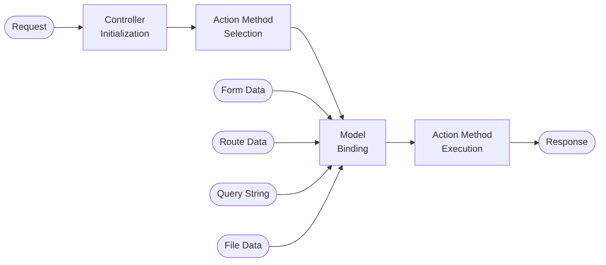
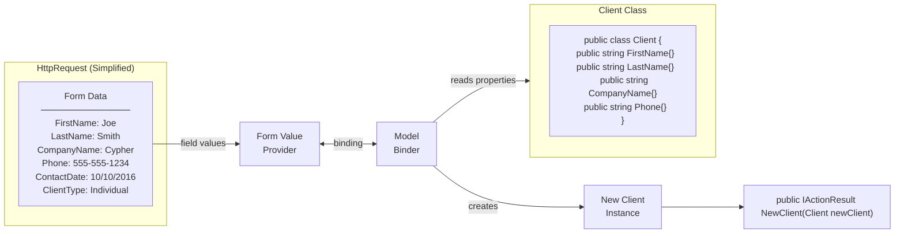

# MVC

- Introduction to formatting response data in ASP.NET Core MVC [1]
- [MVC 6](../netcore/Building.A.Web.App.With.ASP.NET.Core.MVC6.EFCore.And.Angular.md#mvc-6) for 'Building a Web App with ASP.NET Core, MVC 6, EF Core, and Angular'
- [Razor](./razor.md) wiki page

## Model Binding

The **MVC** pipeline processes each incoming request through a sequence of stages before executing the action method. Model binding is the stage that populates action method parameters from the request.



Model binding reads values from **Form Data**, **Route Data**, **Query String**, and **File Data** and populates the action method parameters automatically.

```csharp
public IActionResult NewClient(Client newClient)
{
    return View();
}
```

## Form Data Binding

When an HTTP POST is submitted, the **Form Value Provider** reads each field from the request body and the **Model Binder** maps those values onto a new instance of the target class.



The Model Binder reflects over the `Client` class properties and assigns each matching form field value, producing a fully-populated object passed directly into the controller action.

[<<](../ASP.md) | [home](../../README.md)

[1]: https://docs.microsoft.com/en-us/aspnet/core/mvc/models/formatting
